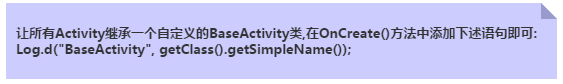

# Android

## 事件处理

### 基于监听的事件处理机制

### 基于回调的事件处理机制

### Handler消息传递机制

### TouchListener & OnTouchEvent

### 监听EditText内容变化

### 响应系统设置的事件（Configuration类）

### AnsyncTask异步任务

### Gestures（手势）

## 四大组件

### Activity

1. Activity用于显示用户界面，用户通过Activity交互完成相关操作 
2. 一个App允许有多个Activity

#### 生命周期


#### 创建


>Android中的四大组件，只要你定义了，无论你用没用，都要在AndroidManifest.xml对 这个组件进行声明，不然运行时程序会直接退出，报ClassNotFindException...

```java
public void onCreate(Bundle savedInstanceState, PersistableBundle persistableBundle)
```

PersistableBundle使我们的Activity就拥有了持久化的能力，需要在配置中添加下面的属性：

```xml
android:persistableMode="persistAcrossReboots"
```

一般我们会搭配另外两个方法来使用

1. `public void onSaveInstanceState(Bundle outState, PersistableBundle outPersistentState) `保存状态
   1. 点击home键回到主页或长按后选择运行其他程序
   2. 按下电源键关闭屏幕
   3. 启动新的Activity
   4. 横竖屏切换时，肯定会执行，因为横竖屏切换的时候会先销毁Act，然后再重新创建 重要原则：当系统"未经你许可"时销毁了你的activity，则onSaveInstanceState会被系统调用， 这是系统的责任，因为它必须要提供一个机会让你保存你的数据
2. `public void onRestoreInstanceState(Bundle savedInstanceState, PersistableBundle persistentState) `取出数据
   1.  一般是在onStart()和onResume()之间执行，和onCreate同样可以从取出前面保存的数据

#### 启动

显式启动

```java
// 1. 最常见的
startActivity(new Intent(当前Act.this,要启动的Act.class));
// 2. 通过Intent的ComponentName
ComponentName cn = new ComponentName("当前Act的全限定类名","启动Act的全限定类名") ;
Intent intent = new Intent() ;
intent.setComponent(cn) ;
startActivity(intent) ;
// 3. 初始化Intent时指定包名
Intent intent = new Intent("android.intent.action.MAIN");
intent.setClassName("当前Act的全限定类名","启动Act的全限定类名");
startActivity(intent);
```

隐式启动: 通过Intent-filter的Action,Category或data来实现 这个是通过Intent的 intent-filter**来实现的。

#### 横竖屏切换

App横竖屏切换的时候会销毁当前的Activity然后重新创建一个，走的流程是：onPause-> onStop-> onDestory-> onCreate->onStart->onResume

AndroidManifest.xml中android:screenOrientation设置横竖屏显示，可取值有：unspecified/landscape/portrait/user/behind/sensor/nosensor

横竖屏时想加载不同的布局的方法：

1. 准备两套不同的布局，Android会自己根据横竖屏加载不同布局： 创建两个布局文件夹：layout-land横屏,layout-port竖屏 然后把这两套布局文件丢这两文件夹里，文件名一样，Android就会自行判断，然后加载相应布局了。
2. 在onCreate()对横竖屏的状态做下判断，加载不同布局文件

```java
if (this.getResources().getConfiguration().orientation == Configuration.ORIENTATION_LANDSCAPE){  
     setContentView(R.layout.横屏);
}  
else if (this.getResources().getConfiguration().orientation ==Configuration.ORIENTATION_PORTRAIT) {  
    setContentView(R.layout.竖屏);
}
```

#### 状态保存

```java
onCreate(Bundle savedInstanceState);
onSaveInstanceState(Bundle outState);
onRestoreInstanceState(Bundle savedInstanceState);
```

```java
outState.putInt("num",1);	// save到bundle中
savedInstanceState.getInt("num");	// 从bundle中拿出来
```

#### Activity间的数据传递


> 在使用Bundle传递数据时，要注意，Bundle的大小是有限制的 < 0.5MB，如果大于这个值 是会报TransactionTooLargeException异常的！

多个Activity间的交互(后一个传回给前一个)


知晓当前是哪个Activity



#### 关闭Activity的方法

##### 随时关闭所有Activity

用一个list集合来存储所有Activity


```java
public class ActivityCollector {  
    public static LinkedList<Activity> activities = new LinkedList<Activity>();  
    public static void addActivity(Activity activity)  
    {  
        activities.add(activity);  
    }  
    public static void removeActivity(Activity activity)  
    {  
        activities.remove(activity);  
    }  
    public static void finishAll()  
    {  
        for(Activity activity:activities)  
        {  
            if(!activity.isFinishing())  
            {  
                activity.finish();  
            }  
        }  
    }  
}  
```

##### 完全退出App的方法，连后台任务都杀死 

```
public void AppExit(Context context) {  
    try {  
        ActivityCollector.finishAll();  
        ActivityManager activityMgr = (ActivityManager) context  
                .getSystemService(Context.ACTIVITY_SERVICE);  
        activityMgr.killBackgroundProcesses(context.getPackageName());  
        System.exit(0);  
    } catch (Exception ignored) {}  
}
```

##### 双击返回退出程序的方法

1. 定义一个变量，来标识是否退出
2. 保存点击时间

##### 为Activity设置过场动画

##### onWindowFocusChanged方法

##### 定义对话框风格的Activity

```xml
android:theme="@android:style/Theme.Dialog"
```


### Service

### BroadcastReceiver

### ContentProvider

### Intent

## Fragment

## 数据存储

### 文件读写

### SharedPreferences

### SQLite

## 网络编程


