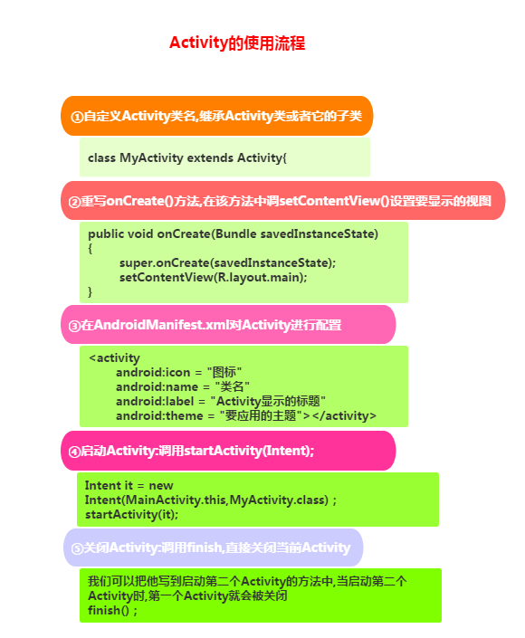

# Android

## 1. 事件处理

### 1.1 基于监听的事件处理机制

### 1.2 基于回调的事件处理机制

### 1.3 Handler消息传递机制

### 1.4 TouchListener & OnTouchEvent

### 1.5 监听EditText内容变化

### 1.6 响应系统设置的事件（Configuration类）

### 1.7 AnsyncTask异步任务

### 1.8 Gestures（手势）

## 2. 四大组件

### 2.1 Activity

1. Activity用于显示用户界面，用户通过Activity交互完成相关操作 
2. 一个App允许有多个Activity

#### 2.1.1 生命周期


#### 2.1.2 创建



>Android中的四大组件，只要你定义了，无论你用没用，都要在AndroidManifest.xml对 这个组件进行声明，不然运行时程序会直接退出，报ClassNotFindException...

```java
public void onCreate(Bundle savedInstanceState, PersistableBundle persistableBundle)
```

PersistableBundle使我们的Activity就拥有了持久化的能力，需要在配置中添加下面的属性：

```xml
android:persistableMode="persistAcrossReboots"
```

一般我们会搭配另外两个方法来使用

1. `public void onSaveInstanceState(Bundle outState, PersistableBundle outPersistentState) `保存状态
   1. 点击home键回到主页或长按后选择运行其他程序
   2. 按下电源键关闭屏幕
   3. 启动新的Activity
   4. 横竖屏切换时，肯定会执行，因为横竖屏切换的时候会先销毁Act，然后再重新创建 重要原则：当系统"未经你许可"时销毁了你的activity，则onSaveInstanceState会被系统调用， 这是系统的责任，因为它必须要提供一个机会让你保存你的数据
2. `public void onRestoreInstanceState(Bundle savedInstanceState, PersistableBundle persistentState) `取出数据
   1.  一般是在onStart()和onResume()之间执行，和onCreate同样可以从取出前面保存的数据


#### 2.1.3 启动

显式启动

```java
// 1. 最常见的
startActivity(new Intent(当前Act.this,要启动的Act.class));
// 2. 通过Intent的ComponentName
ComponentName cn = new ComponentName("当前Act的全限定类名","启动Act的全限定类名") ;
Intent intent = new Intent() ;
intent.setComponent(cn) ;
startActivity(intent) ;
// 3. 初始化Intent时指定包名
Intent intent = new Intent("android.intent.action.MAIN");
intent.setClassName("当前Act的全限定类名","启动Act的全限定类名");
startActivity(intent);
```

隐式启动: 通过Intent-filter的Action,Category或data来实现 这个是通过Intent的 intent-filter**来实现的。


#### 2.1.4 横竖屏切换

App横竖屏切换的时候会销毁当前的Activity然后重新创建一个，走的流程是：onPause-> onStop-> onDestory-> onCreate->onStart->onResume

AndroidManifest.xml中android:screenOrientation设置横竖屏显示，可取值有：unspecified/landscape/portrait/user/behind/sensor/nosensor

横竖屏时想加载不同的布局的方法：

1. 准备两套不同的布局，Android会自己根据横竖屏加载不同布局： 创建两个布局文件夹：layout-land横屏,layout-port竖屏 然后把这两套布局文件丢这两文件夹里，文件名一样，Android就会自行判断，然后加载相应布局了。
2. 在onCreate()对横竖屏的状态做下判断，加载不同布局文件

```java
if (this.getResources().getConfiguration().orientation == Configuration.ORIENTATION_LANDSCAPE){  
     setContentView(R.layout.横屏);
}  
else if (this.getResources().getConfiguration().orientation ==Configuration.ORIENTATION_PORTRAIT) {  
    setContentView(R.layout.竖屏);
}
```


#### 2.1.5 状态保存

```java
onCreate(Bundle savedInstanceState);
onSaveInstanceState(Bundle outState);
onRestoreInstanceState(Bundle savedInstanceState);
```

```java
outState.putInt("num",1);	// save到bundle中
savedInstanceState.getInt("num");	// 从bundle中拿出来
```


#### 2.1.6 Activity间的数据传递


> 在使用Bundle传递数据时，要注意，Bundle的大小是有限制的 < 0.5MB，如果大于这个值 是会报TransactionTooLargeException异常的！

多个Activity间的交互(后一个传回给前一个)


知晓当前是哪个Activity


#### 2.1.7 关闭Activity的方法

##### 2.1.7.1 随时关闭所有Activity

用一个list集合来存储所有Activity


```java
public class ActivityCollector {  
    public static LinkedList<Activity> activities = new LinkedList<Activity>();  
    public static void addActivity(Activity activity)  
    {  
        activities.add(activity);  
    }  
    public static void removeActivity(Activity activity)  
    {  
        activities.remove(activity);  
    }  
    public static void finishAll()  
    {  
        for(Activity activity:activities)  
        {  
            if(!activity.isFinishing())  
            {  
                activity.finish();  
            }  
        }  
    }  
}  
```

##### 2.1.7.2 完全退出App的方法，连后台任务都杀死 

```
public void AppExit(Context context) {  
    try {  
        ActivityCollector.finishAll();  
        ActivityManager activityMgr = (ActivityManager) context  
                .getSystemService(Context.ACTIVITY_SERVICE);  
        activityMgr.killBackgroundProcesses(context.getPackageName());  
        System.exit(0);  
    } catch (Exception ignored) {}  
}
```

##### 2.1.7.3 双击返回退出程序的方法

1. 定义一个变量，来标识是否退出
2. 保存点击时间


#### 2.1.8 为Activity设置过场动画


#### 2.1.9 onWindowFocusChanged方法


#### 2.1.10 定义对话框风格的Activity

```xml
android:theme="@android:style/Theme.Dialog"
```


#### 2.1.11 Activity，Window与View的关系


#### 2.1.12 Activity，Task和Back Stack


Task是Activity的集合，是一个概念，实际使用的Back Stack来存储Activity，可以有多个Task，但是同一时刻只有一个栈在最前面，其他的都在后台！那栈是如何产生的呢？

答：当我们通过主屏幕，点击图标打开一个新的App，此时会创建一个新的Task！举个例子：我们通过点击通信录APP的图标打开APP，这个时候会新建一个栈1，然后开始把新产生的Activity添加进来，可能我们在通讯录的APP中打开了短信APP的页面，但是此时不会新建一个栈，而是继续添加到栈1中，这是 Android推崇一种用户体验方式，即不同应用程序之间的切换能使用户感觉就像是同一个应用程序， 很连贯的用户体验，官方称其为seamless (无缝衔接）。


#### 2.1.13 Task的管理

Ref: [https://developer.android.com/guide/components/tasks-and-back-stack.html](https://developer.android.com/guide/components/tasks-and-back-stack.html)

> Android 管理任务和返回栈的方式（如上所述，即：将所有连续启动的 Activity 放入同一任务和“后进先出”堆栈中）非常适用于大多数应用，而您不必担心 Activity 如何与任务关联或者如何存在于返回栈中。 但是，您可能会决定要中断正常行为。 也许您希望应用中的 Activity 在启动时开始新任务（而不是放置在当前任务中）；或者，当启动 Activity 时，您希望将其现有实例上移一层（而不是在返回栈的顶部创建新实例）；或者，您希望在用户离开任务时，清除返回栈中除根 Activity 以外的所有其他 Activity。
>
> 通过使用 <activity > 清单文件元素中的属性和传递给 startActivity() 的 Intent 中的标志，您可以执行所有这些操作以及其他操作。


#### 2.1.14 Activity的四种启动模式


1. **standard模式** ：系统在启动 Activity 的任务中创建 Activity 的新实例并向其传送 Intent。Activity 可以多次实例化，而每个实例均可属于不同的任务，并且一个任务可以拥有多个实例。

2. **singleTop模式** ：如果一个以singleTop模式启动的Activity的实例已经存在于任务栈的栈顶， 那么再启动这个Activity时，不会创建新的实例，而是重用位于栈顶的那个实例， 并且会调用该实例的`onNewIntent()`方法将Intent对象传递到这个实例中。如果以singleTop模式启动的activity的一个实例已经存在与任务栈中，但是不在栈顶，那么它的行为和standard模式相同，也会创建多个实例。

   例如: 假如一个任务返回栈是A-B-C-D（D为栈顶），收到D的Intent时，若D是standard，则会新建一个D实例，堆栈变为A-B-C-D-D，若D是singleTop，则D的现有实例会通过OnNewIntent()接收Intent，堆栈仍为A-B-C-D。但是若收到B的Intent，则堆栈变为A-B-C-D-B.

3. **singleTask模式** ：系统创建新任务并实例化位于新任务底部的 Activity。但是，如果该 Activity 的一个实例已存在于一个单独的任务中，则系统会通过调用现有实例的 onNewIntent() 方法向其传送 Intent，而不是创建新实例。一次只能存在 Activity 的一个实例。尽管 Activity 在新任务中启动，但是用户按“返回”按钮仍会返回到前一个 Activity。

4. **singleInstance模式** ：和singleTask类似，如果系统中已经存在一个这个Activity的实例，会将这个实例所在的Task调度到前台，重用这个Activity的实例（**该Task中只有这一个Activity**），如果不存在，会开启一个新任务，并在这个新Task中启动这个singleInstance模式的Activity的一个实例。该 Activity 始终是其任务唯一仅有的成员；且由此 Activity 启动的任何 Activity 均在单独的任务中打开。

无论 Activity 是在新任务中启动，还是在与启动 Activity 相同的任务中启动，用户按“返回”按钮始终会转到前一个 Activity。 但是，如果启动指定 singleTask 启动模式的 Activity，则当某后台任务中存在该 Activity 的实例时，整个任务都会转移到前台。此时，返回栈包括上移到堆栈顶部的任务中的所有 Activity。如下图所示（包含Y的backstack整体移动到了2所在backstack的顶部）：


#### 2.1.15 使用 Intent 标志

启动 Activity 时，您可以通过在传递给 startActivity() 的 Intent 中加入相应的标志，修改 Activity 与其任务的默认关联方式。

1. **FLAG_ACTIVITY_NEW_TASK** : 在新任务中启动 Activity。如果已为正在启动的 Activity 运行任务，则该任务会转到前台并恢复其最后状态，同时 Activity 会在 onNewIntent() 中收到新 Intent。这会产生与 "singleTask"launchMode 值相同的行为。
2. **FLAG_ACTIVITY_CLEAR_TOP** : 如果正在启动的 Activity 是当前 Activity（位于返回栈的顶部），则 现有实例会接收对 onNewIntent() 的调用，而不是创建 Activity 的新实例。这会产生与 "singleTop"launchMode 值相同的行为。
3. **FLAG_ACTIVITY_SINGLE_TOP** : 如果正在启动的 Activity 已在当前任务中运行，则会销毁当前任务顶部的所有 Activity，并通过 onNewIntent() 将此 Intent 传递给 Activity 已恢复的实例（现在位于顶部），而不是启动该 Activity 的新实例。产生这种行为的 launchMode 属性没有值。

总结：每个应用都可能调用同一个Activity，这个Activity的实例就存在于多个backstack中。backstack只有push和pop操作，新启动一个Activity时，创建后push进来，点击返回时，pop出去并销毁，栈内的Activity顺序不能改变。


#### 2.1.16 文件关联

“关联”指示 Activity 优先属于哪个任务。默认情况下，同一应用中的所有 Activity 彼此关联。 因此，默认情况下，同一应用中的所有 Activity 优先位于相同任务中。 不过，您可以修改 Activity 的默认关联。 在不同应用中定义的 Activity 可以共享关联，或者可为在同一应用中定义的 Activity 分配不同的任务关联。

可以使用 <activity> 元素的 taskAffinity 属性修改任何给定 Activity 的关联。

在两种情况下，关联会起作用：

* 当启动 activity的Intent对象包含**FLAG_ACTIVITY_NEW_TASK** 标记时，系统会为需要启动的Activity寻找与当前Activity不同Task。如果要启动的 Activity的Affinity属性与当前所有的Task的Affinity属性都不相同，系统会新建一个带那个Affinity属性的Task，并将要启动的Activity压到新建的Task栈中；否则将Activity压入那个Affinity属性相同的栈中。
* 如果一个activity的**allowTaskReparenting** 属性为true， 那么它可以从一个Task（Task1）移到另外一个有相同Affinity的Task（Task2）中（Task2带到前台时）。

> 如果从用户的角度来看，一个 `.apk` 文件包含多个“应用”，则您可能需要使用 [`taskAffinity`](https://developer.android.com/guide/topics/manifest/activity-element.html#aff) 属性将不同关联分配给与每个“应用”相关的 Activity。


#### 2.1.17 处理返回栈

清空栈：当用户长时间离开Task（当前task被转移到后台）时，系统会清除task中栈底Activity外的所有Activity 。这样，当用户返回到Task时，只留下那个task最初始的Activity了。我们可以通过修改下面这些属性来 改变这种行为！

* **alwaysRetainTaskState** ：如果栈底Activity的这个属性被设置为true，上述的情况就不会发生。 Task中的所有activity将被长时间保存。
* **clearTaskOnLaunch** ：如果栈底activity的这个属性被设置为true，一旦用户离开Task， 则 Task栈中的Activity将被清空到只剩下栈底activity。这种情况刚好与 alwaysRetainTaskState相反。即使用户只是短暂地离开，task也会返回到初始状态 （只剩下栈底acitivty）。
* **finishOnTaskLaunch** ：与clearTaskOnLaunch相似，但它只对单独的activity操 作，而不是整个Task。它可以结束任何Activity，包括栈底的Activity。 当它设置为true时，当前的Activity只在当前会话期间作为Task的一部分存在， 当用户退出Activity再返回时，它将不存在。


#### 2.1.18 启动任务

通过为 Activity 提供一个以 "android.intent.action.MAIN" 为指定操作、以 "android.intent.category.LAUNCHER" 为指定类别的 Intent 过滤器，您可以将 Activity 设置为任务的入口点。此类 Intent 过滤器会使 Activity 的图标和标签显示在应用启动器中，让用户能够启动 Activity 并在启动之后随时返回到创建的任务中。

```xml
<activity ... >
    <intent-filter ... >
        <action android:name="android.intent.action.MAIN" />
        <category android:name="android.intent.category.LAUNCHER" />
    </intent-filter>
    ...
</activity>
```


### 2.2 Service

后台执行不提供用户界面。

组件可以绑定到服务，以与之进行交互，甚至是执行进程间通信 (IPC)。例如处理网络事务、播放音乐，执行文件 I/O.

1. 启动：调用 startService() 启动服务时，服务即处于“启动”状态。可在后台无限期运行，即使启动服务的组件已被销毁也不受影响。已启动的服务通常是执行单一操作，而且不会将结果返回给调用方。操作完成后，服务会自行停止运行。
2. 绑定：调用 bindService() 绑定到服务时，服务即处于“绑定”状态。绑定服务提供了一个客户端-服务器接口，允许组件与服务进行交互、发送请求、获取结果，甚至是利用进程间通信 (IPC) 跨进程执行这些操作。**仅当与另一个应用组件绑定时，绑定服务才会运行**。多个组件可以同时绑定到该服务，但全部取消绑定后，该服务即会被销毁。

服务可以同时以这两种方式运行，只要实现了一组回调方法：onStartCommand()（允许组件启动服务）和 onBind()（允许绑定服务）

任何应用组件均可像使用 Activity 那样通过调用 Intent 来使用服务（即使此服务来自另一应用）。 不过，您可以通过清单文件将服务声明为私有服务，并阻止其他应用访问。

> 注意：服务在其托管进程的主线程中运行，它既不创建自己的线程，也不在单独的进程中运行（除非另行指定）。 因此，如果服务将执行任何 CPU 密集型工作或阻止性操作（例如 MP3 播放或联网），则应在服务内创建新线程来完成这项工作。通过使用单独的线程，可以降低发生“应用无响应”(ANR) 错误的风险，而应用的主线程仍可继续专注于运行用户与 Activity 之间的交互。

#### 2.2.1 基础知识

创建 Service 的子类，应重写的回调方法包括：

1. `onStartCommand()`: 当另一个组件（如 Activity）通过调用 startService() 请求启动服务时，系统将调用此方法。一旦执行此方法，服务即会启动并可在后台无限期运行。 如果您实现此方法，则在服务工作完成后，需要由您通过（服务自身）调用 stopSelf() 或（其他组件）调用 stopService() 来停止服务。（如果您只想提供绑定，则无需实现此方法。）
2. `onBind()`: 当另一个组件想通过调用 bindService() 与服务绑定（例如执行 RPC）时，系统将调用此方法。在此方法的实现中，您必须通过返回 IBinder 提供一个接口，供客户端用来与服务进行通信。请务必实现此方法，但如果您并不希望允许绑定，则应返回 null。
3. `onCreate()`: 首次创建服务时，系统将调用此方法来执行一次性设置程序（在调用 onStartCommand() 或 onBind() 之前）。如果服务已在运行，则不会调用此方法。
4. `onDestroy()`: 当服务不再使用且将被销毁时，系统将调用此方法。服务应该实现此方法来清理所有资源，如线程、注册的侦听器、接收器等。 这是服务接收的最后一个调用。

仅当内存过低且必须回收系统资源以供具有用户焦点的 Activity 使用时，Android 系统才会强制停止服务。如果将服务绑定到具有用户焦点的 Activity，则它不太可能会终止；如果将服务声明为在前台运行（稍后讨论），则它几乎永远不会终止。

#### 2.2.2 使用清单文件声明服务

* android:name ：必需的属性，指定服务的类名。应用一旦发布，即不应更改此类名，如若不然，可能会存在因依赖显式 Intent 启动或绑定服务而破坏代码的风险。
* android:exported=false：确保服务仅适用于您的应用

#### 2.2.3 创建服务

应用组件（如 Activity）可以通过调用 startService() 方法并传递 Intent 对象（指定服务并包含待使用服务的所有数据）来启动服务。服务通过 onStartCommand() 方法接收此 Intent。

* **Service** ：这是适用于所有服务的基类。扩展此类时，必须创建一个用于执行所有服务工作的新线程，因为默认情况下，服务将使用应用的主线程，这会降低应用正在运行的所有 Activity 的性能。
* **IntentService** ：这是 Service 的子类，它使用工作线程逐一处理所有启动请求。如果您**不要求服务同时处理多个请求**，这是最好的选择。 您只需实现 onHandleIntent() 方法即可，该方法会接收每个启动请求的 Intent，使您能够执行后台工作。

#### 2.2.4 启动服务

```java
Intent intent = new Intent(this, HelloService.class);
startService(intent);
```

startService() 方法将立即返回，且 Android 系统调用服务的 onStartCommand() 方法。如果服务尚未运行，则系统会先调用 onCreate()，然后再调用 onStartCommand()。

如果服务亦未提供绑定，则使用 startService() 传递的 Intent 是应用组件与服务之间唯一的通信模式。但是，如果您希望服务返回结果，则启动服务的客户端可以为广播创建一个 PendingIntent （使用 getBroadcast()），并通过启动服务的 Intent 传递给服务。然后，服务就可以使用广播传递结果。

多个服务启动请求会导致多次对服务的 onStartCommand() 进行相应的调用。但是，要停止服务，只需一个服务停止请求（使用 stopSelf() 或 stopService()）即可。

#### 2.2.5 停止服务

使用 `stopSelf()` 或 `stopService()` 停止服务，系统就会尽快销毁服务

#### 2.2.6 创建绑定服务

调用 `bindService()` 与其绑定

必须实现 `onBind()` 回调方法以返回 `IBinder`，用于定义与服务通信的接口。

多个客户端可以同时绑定到服务。客户端完成与服务的交互后，会调用 unbindService() 取消绑定。一旦没有客户端绑定到该服务，系统就会销毁它。所以绑定服务不需要手动停止。

#### 2.2.7 向用户发送通知

服务即可使用 Toast 通知或状态栏通知来通知用户所发生的事件。

#### 2.2.8 在前台运行服务

要请求让服务运行于前台，请调用 `startForeground()`。两个参数：唯一标识通知的整型数和状态栏的 `Notification`。

要从前台移除服务，请调用 `stopForeground()`。此方法采用一个布尔值，指示是否也移除状态栏通知。 此方法*不会*停止服务。 但是，如果您在服务正在前台运行时将其停止，则通知也会被移除。

#### 2.2.9 管理服务生命周期

服务生命周期（从创建到销毁）可以遵循两条不同的路径：

- 启动服务

  该服务在其他组件调用 `startService()` 时创建，然后无限期运行，且必须通过调用 `stopSelf()` 来自行停止运行。此外，其他组件也可以通过调用`stopService()` 来停止服务。服务停止后，系统会将其销毁。

- 绑定服务

  该服务在另一个组件（客户端）调用 `bindService()` 时创建。然后，客户端通过 `IBinder` 接口与服务进行通信。客户端可以通过调用`unbindService()` 关闭连接。多个客户端可以绑定到相同服务，而且当所有绑定全部取消后，系统即会销毁该服务。 （服务*不必*自行停止运行。）

这两条路径并非完全独立。也就是说，您可以绑定到已经使用 `startService()` 启动的服务。例如，可以通过使用 `Intent`（标识要播放的音乐）调用 `startService()` 来启动后台音乐服务。随后，可能在用户需要稍加控制播放器或获取有关当前播放歌曲的信息时，Activity 可以通过调用 `bindService()`绑定到服务。在这种情况下，除非所有客户端均取消绑定，否则 `stopService()` 或 `stopSelf()` 不会实际停止服务。


与 Activity 生命周期回调方法不同，您*不*需要调用这些回调方法的超类实现。

服务的**整个生命周期**从调用 `onCreate()` 开始起，到 `onDestroy()` 返回时结束。

服务的**有效生命周期**从调用 `onStartCommand()` 或 `onBind()` 方法开始。对于启动服务，有效生命周期与整个生命周期同时结束（即便是在 `onStartCommand()` 返回之后，服务仍然处于活动状态）。对于绑定服务，有效生命周期在 `onUnbind()` 返回时结束。


### 2.3 BroadcastReceiver

### 2.4 ContentProvider

### 2.5 Intent


### 2.6 进程和线程

Ref: [https://developer.android.com/guide/components/processes-and-threads.html](https://developer.android.com/guide/components/processes-and-threads.html)

#### 2.6.1 进程

默认情况下，同一应用的所有组件均在相同的进程中运行。当需要控制某个组件所属的进程，则可在清单文件中修改。<activity>、<service>、<receiver> 和 <provider>—均支持 android:process 属性，此属性可以指定该组件应在哪个进程运行。可以是一个应用的不同组件在不同进程运行，也可以使某些组件在一个进程运行，甚至可以使不同应用的组件在一个进程中运行（前提是这些应用共享相同的Linux用户ID并使用了相同的证书签名）

<application>也支持android:process属性，用于所有组件的默认值。

如果内存不足，系统可能关闭某一进程，其包含的组件也会随之销毁。终止进程时，Android 系统将权衡它们对用户的相对重要程度，前台不再显示的Activity所在的进程更可能被关闭。

#### 2.6.2 进程生命周期

系统会根据进程中正在运行的组件以及这些组件的状态，将每个进程放入“重要性层次结构”中。 必要时，系统会首先消除重要性最低的进程，然后是重要性略逊的进程，依此类推，以回收系统资源。

重要性层次结构一共有 5 级：

1. 前台进程
2. 可见进程
3. 服务进程
4. 后台进程
5. 空进程

一个进程的级别可能会因其他进程对它的依赖而有所提高，即服务于另一进程的进程其级别永远不会低于其所服务的进程。

#### 2.6.3 线程

主线程有时也称为 UI 线程。

系统不会为每个组件实例创建单独的线程。运行于同一进程的所有组件均在 UI 线程中实例化，并且对每个组件的系统调用（如报告用户操作的 onKeyDown() 或生命周期回调方法）均由该线程进行分派。

如果 UI 线程需要处理所有任务，则执行耗时很长的操作（例如，网络访问或数据库查询）将会阻塞整个 UI。 一旦线程被阻塞，将无法分派任何事件，包括绘图事件。 从用户的角度来看，应用显示为挂起。 更糟糕的是，如果 UI 线程被阻塞超过几秒钟时间（目前大约是 5 秒钟），用户就会看到一个让人厌烦的“应用无响应”(ANR) 对话框。

Android UI 工具包**并非** 线程安全工具包。因此，您不得通过工作线程操纵 UI，而只能通过 UI 线程操纵用户界面。因此单线程模式有两条基本原则：

1. 不要阻塞 UI 线程
2. 不要在 UI 线程之外访问 Android UI 工具包

#### 2.6.4 工作线程

```java
public void onClick(View v) {
    new Thread(new Runnable() {
        public void run() {
            Bitmap b = loadImageFromNetwork("http://example.com/image.png");
            mImageView.setImageBitmap(b);
        }
    }).start();
}
```

上面代码看似运行良好，实际上违反了单线程模式的第二条规则：不要在 UI 线程之外访问 Android UI 工具包 — 此示例从工作线程（而不是 UI 线程）修改了 ImageView。 这可能导致出现不明确、不可预见的行为，但要跟踪此行为困难而又费时。

Android提供了如下方法解决此问题：

* `Activity.runOnUiThread(Runnable)`
* `View.post(Runnable)`
* `View.postDelayed(Runnable, long)`

要通过工作线程处理更复杂的交互，可以考虑在工作线程中使用 Handler 处理来自 UI 线程的消息。当然，最好的解决方案或许是扩展 AsyncTask 类，此类简化了与 UI 进行交互所需执行的工作线程任务。

**AsyncTask** 

Ref: [https://developer.android.com/reference/android/os/AsyncTask.html](https://developer.android.com/reference/android/os/AsyncTask.html)

AsyncTask 允许对用户界面执行异步操作。 它会先阻塞工作线程中的操作，然后在 UI 线程中发布结果，而无需您亲自处理线程和/或处理程序。

要使用它，必须创建 AsyncTask 的子类并实现 doInBackground() 回调方法，该方法将在后台线程池中运行。 要更新 UI，应该实现 onPostExecute() 以传递 doInBackground() 返回的结果并在 UI 线程中运行，以便您安全地更新 UI。 稍后，您可以通过从 UI 线程调用 execute() 来运行任务。

```java
public void onClick(View v) {
    new DownloadImageTask().execute("http://example.com/image.png");
}

private class DownloadImageTask extends AsyncTask<String, Void, Bitmap> {
    /** The system calls this to perform work in a worker thread and
      * delivers it the parameters given to AsyncTask.execute() */
    protected Bitmap doInBackground(String... urls) {
        return loadImageFromNetwork(urls[0]);
    }

    /** The system calls this to perform work in the UI thread and delivers
      * the result from doInBackground() */
    protected void onPostExecute(Bitmap result) {
        mImageView.setImageBitmap(result);
    }
}
```

#### 2.6.5 线程安全方法

#### 2.6.6 进程间通信 

Android 利用远程过程调用 (RPC) 提供了一种进程间通信 (IPC) 机制，Android 提供了执行这些 IPC 事务所需的全部代码，因此您只需集中精力定义和实现 RPC 编程接口即可。

要执行 IPC，必须使用 `bindService()` 将应用绑定到服务上。


## Fragment

## 数据存储

### 文件读写

### SharedPreferences

### SQLite

## 网络编程


