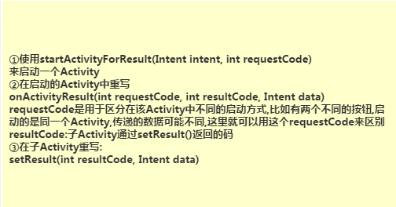
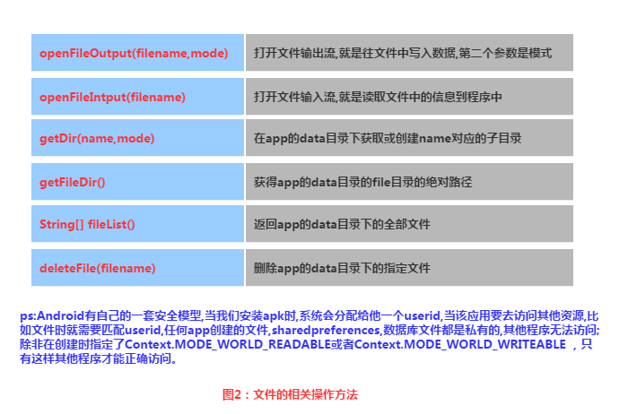
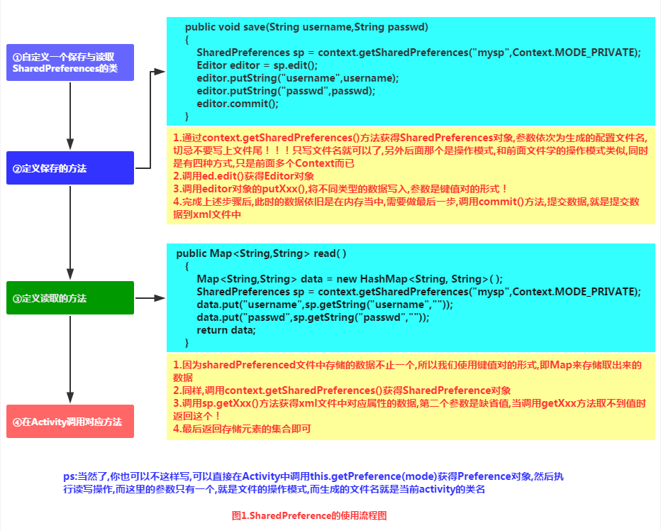
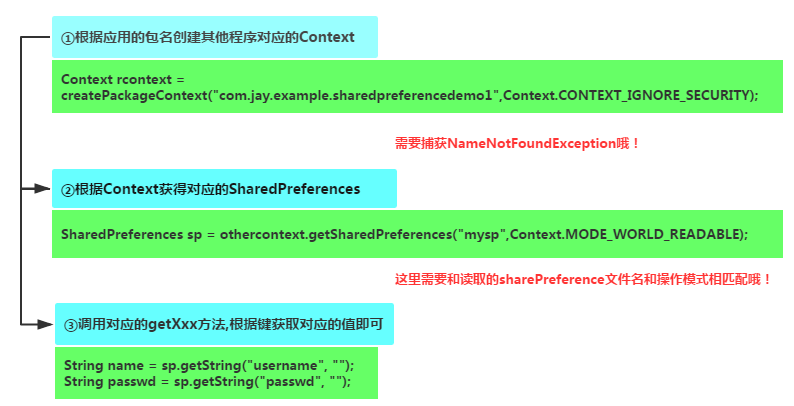

# Android

## 1. 事件处理

### 1.1 基于监听的事件处理机制

流程模型图


事件监听机制中由**事件源**，**事件**，**事件监听器**三类对象组成 处理流程如下: 

1. **Step 1:**为某个事件源(组件)设置一个监听器,用于监听用户操作 
2. **Step 2:**用户的操作,触发了事件源的监听器 
3. **Step 3:**生成了对应的事件对象 
4. **Step 4:**将这个事件源对象作为参数传给事件监听器 
5. **step 5:**事件监听器对事件对象进行判断,执行对应的事件处理器(对应事件的处理方法)

事件监听机制是一种委派式的事件处理机制,事件源(组件)事件处理委托给事件监听器 当事件源发生指定事件时,就通知指定事件监听器,执行相应的操作。

#### 五种使用形式

1. 直接用匿名内部类: 平时最常用的一种:直接setXxxListener后,重写里面的方法即可; 通常是临时使用一次,复用性不高。

   ```java
   btnshow = (Button) findViewById(R.id.btnshow);    
           btnshow.setOnClickListener(new OnClickListener() {    
               //重写点击事件的处理方法onClick()    
               @Override    
               public void onClick(View v) {    
                   //显示Toast信息    
                   Toast.makeText(getApplicationContext(), "你点击了按钮", Toast.LENGTH_SHORT).show();    
               }
           });
   ```

2. 使用内部类: 和上面的匿名内部类不同哦！ 使用优点:可以在该类中进行复用,可直接访问外部类的所有界面组件。

   ```java
   class BtnClickListener implements View.OnClickListener    
       {    
           @Override    
           public void onClick(View v) {    
               Toast.makeText(getApplicationContext(), "按钮被点击了", Toast.LENGTH_SHORT).show();   
           }    
       }
   btnshow.setOnClickListener(new BtnClickListener());
   ```

3. 使用外部类：就是另外创建一个处理事件的Java文件,这种形式用的比较少！因为外部类不能直接访问用户界面 类中的组件,要通过构造方法将组件传入使用;这样导致的结果就是代码不够简洁！

4. 直接使用Activity作为事件监听器: 只需要让Activity类实现XxxListener事件监听接口,在Activity中定义重写对应的事件处理器方法 eg:Actitity实现了OnClickListener接口,重写了onClick(view)方法在为某些组建添加该事件监听对象 时,直接setXxx.Listener(this)即可。

   ```java
   //让Activity方法实现OnClickListener接口    
   public class MainActivity extends Activity implements OnClickListener{
   //重写接口中的抽象方法    
       @Override    
       public void onClick(View v) {  }
       btnshow.setOnClickListener(this);// 直接调用this即可
   }
   ```

5. 直接绑定到标签: 就是直接在xml布局文件中对应得Activity中定义一个事件处理方法 eg:public void myClick(View source) source对应事件源(组件) 接着布局文件中对应要触发事件的组建,设置一个属性:onclick = "myclick"即可

   ```java
   // xml中
   <Button android:onClick="myclick"/>   

   //自定义一个方法,传入一个view组件作为参数    
       public void myclick(View source)    
       {    
           ...  
       }
   ```


### 1.2 基于回调的事件处理机制

什么是方法回调?

答:是将功能定义与功能分开的一种手段,一种解耦合的设计思想;在Java中回调是通过接口来实现的, 作为一种系统架构,必须要有自己的运行环境,且需要为用户提供实现接口;实现依赖于客户,这样就可以达到接口统一,实现不同,系统通过在不同的状态下"回调"我们的实现类,从而达到接口和实现的分离！

#### 1.2.1 使用场景

自定义View

当用户在GUI组件上激发某个事件时,组件有自己特定的方法会负责处理该事件 通常用法:继承基本的GUI组件,重写该组件的事件处理方法,即自定义view 注意:在xml布局中使用自定义的view时,需要使用**全限定类名**

android为GUI组件提供了一些事件处理的回调方法,以View为例,有以下几个方法：

* 在该组件上触发屏幕事件: boolean onTouchEvent(MotionEvent event);
* 在该组件上按下某个按钮时: boolean onKeyDown(int keyCode,KeyEvent event);
* 松开组件上的某个按钮时: boolean onKeyUp(int keyCode,KeyEvent event);
* 长按组件某个按钮时: boolean onKeyLongPress(int keyCode,KeyEvent event);
* 键盘快捷键事件发生: boolean onKeyShortcut(int keyCode,KeyEvent event);
* 在组件上触发轨迹球屏事件: boolean onTrackballEvent(MotionEvent event);
* 当组件的焦点发生改变,和前面的6个不同,这个方法只能够在View中重写哦！ protected void onFocusChanged(boolean gainFocus, int direction, Rect previously FocusedRect)

一个简单的按钮,点击按钮后触发onTouchEvent事件,当我们按模拟器上的键盘时, 按下触发onKeyDown,离开键盘时触发onKeyUp事件。

```java
public class MyButton extends Button{  
    private static String TAG = "呵呵";  
    public MyButton(Context context, AttributeSet attrs) {  
        super(context, attrs);  
    }  
  
    //重写键盘按下触发的事件  
    @Override  
    public boolean onKeyDown(int keyCode, KeyEvent event) {  
        super.onKeyDown(keyCode,event);  
        Log.i(TAG, "onKeyDown方法被调用");  
        return true;  
    }  
  
    //重写弹起键盘触发的事件  
    @Override  
    public boolean onKeyUp(int keyCode, KeyEvent event) {  
        super.onKeyUp(keyCode,event);  
        Log.i(TAG,"onKeyUp方法被调用");  
        return true;  
    }  
  
    //组件被触摸了  
    @Override  
    public boolean onTouchEvent(MotionEvent event) {  
        super.onTouchEvent(event);  
        Log.i(TAG,"onTouchEvent方法被调用");  
        return true;  
    }  
} 
```

布局文件：

```xml
<example.jay.com.mybutton.MyButton  />
```

#### 1.2.2 基于回调的事件传播


倘若为false，表示事件未处理完，会继续传播，无论是Listener还是回调方法都是。

传播顺序：**监听器**--->**view组件的回调方法**--->**Activity的回调方法**

### 1.3 Handler消息传递机制

### 1.4 TouchListener & OnTouchEvent

### 1.5 监听EditText内容变化

### 1.6 响应系统设置的事件（Configuration类）

### 1.7 AnsyncTask异步任务

### 1.8 Gestures（手势）


## 2. Activity

1. Activity用于显示用户界面，用户通过Activity交互完成相关操作 
2. 一个App允许有多个Activity

### 2.1 生命周期


### 2.2 创建


>Android中的四大组件，只要你定义了，无论你用没用，都要在AndroidManifest.xml对 这个组件进行声明，不然运行时程序会直接退出，报ClassNotFindException...

```java
public void onCreate(Bundle savedInstanceState, PersistableBundle persistableBundle)
```

PersistableBundle使我们的Activity就拥有了持久化的能力，需要在配置中添加下面的属性：

```xml
android:persistableMode="persistAcrossReboots"
```

一般我们会搭配另外两个方法来使用

1. `public void onSaveInstanceState(Bundle outState, PersistableBundle outPersistentState) `保存状态
   1. 点击home键回到主页或长按后选择运行其他程序
   2. 按下电源键关闭屏幕
   3. 启动新的Activity
   4. 横竖屏切换时，肯定会执行，因为横竖屏切换的时候会先销毁Act，然后再重新创建 重要原则：当系统"未经你许可"时销毁了你的activity，则onSaveInstanceState会被系统调用， 这是系统的责任，因为它必须要提供一个机会让你保存你的数据
2. `public void onRestoreInstanceState(Bundle savedInstanceState, PersistableBundle persistentState) `取出数据
   1.  一般是在onStart()和onResume()之间执行，和onCreate同样可以从取出前面保存的数据


### 2.3 启动

显式启动

```java
// 1. 最常见的
startActivity(new Intent(当前Act.this,要启动的Act.class));
// 2. 通过Intent的ComponentName
ComponentName cn = new ComponentName("当前Act的全限定类名","启动Act的全限定类名") ;
Intent intent = new Intent() ;
intent.setComponent(cn) ;
startActivity(intent) ;
// 3. 初始化Intent时指定包名
Intent intent = new Intent("android.intent.action.MAIN");
intent.setClassName("当前Act的全限定类名","启动Act的全限定类名");
startActivity(intent);
```

隐式启动: 通过Intent-filter的Action,Category或data来实现 这个是通过Intent的 intent-filter**来实现的。


### 2.4 横竖屏切换

App横竖屏切换的时候会销毁当前的Activity然后重新创建一个，走的流程是：onPause-> onStop-> onDestory-> onCreate->onStart->onResume

AndroidManifest.xml中android:screenOrientation设置横竖屏显示，可取值有：unspecified/landscape/portrait/user/behind/sensor/nosensor

横竖屏时想加载不同的布局的方法：

1. 准备两套不同的布局，Android会自己根据横竖屏加载不同布局： 创建两个布局文件夹：layout-land横屏,layout-port竖屏 然后把这两套布局文件丢这两文件夹里，文件名一样，Android就会自行判断，然后加载相应布局了。
2. 在onCreate()对横竖屏的状态做下判断，加载不同布局文件

```java
if (this.getResources().getConfiguration().orientation == Configuration.ORIENTATION_LANDSCAPE){  
     setContentView(R.layout.横屏);
}  
else if (this.getResources().getConfiguration().orientation ==Configuration.ORIENTATION_PORTRAIT) {  
    setContentView(R.layout.竖屏);
}
```


### 2.5 状态保存

```java
onCreate(Bundle savedInstanceState);
onSaveInstanceState(Bundle outState) {
  outState.putInt("num",1);	// save到bundle中
}
onRestoreInstanceState(Bundle savedInstanceState) {
  savedInstanceState.getInt("num");	// 从bundle中拿出来
}
```


### 2.6 Activity间的数据传递


> 在使用Bundle传递数据时，要注意，Bundle的大小是有限制的 < 0.5MB，如果大于这个值 是会报TransactionTooLargeException异常的！

多个Activity间的交互(后一个传回给前一个)



知晓当前是哪个Activity


### 2.7 关闭Activity的方法

#### 2.7.1 随时关闭所有Activity

用一个list集合来存储所有Activity


```java
public class ActivityCollector {  
    public static LinkedList<Activity> activities = new LinkedList<Activity>();  
    public static void addActivity(Activity activity)  
    {  
        activities.add(activity);  
    }  
    public static void removeActivity(Activity activity)  
    {  
        activities.remove(activity);  
    }  
    public static void finishAll()  
    {  
        for(Activity activity:activities)  
        {  
            if(!activity.isFinishing())  
            {  
                activity.finish();  
            }  
        }  
    }  
}  
```

#### 2.7.2 完全退出App的方法，连后台任务都杀死

```java
public void AppExit(Context context) {  
    try {  
        ActivityCollector.finishAll();  
        ActivityManager activityMgr = (ActivityManager) context  
                .getSystemService(Context.ACTIVITY_SERVICE);  
        activityMgr.killBackgroundProcesses(context.getPackageName());  
        System.exit(0);  
    } catch (Exception ignored) {}  
}
```

#### 2.7.3 双击返回退出程序的方法

1. 定义一个变量，来标识是否退出
2. 保存点击时间


### 2.8 为Activity设置过场动画


### 2.9 onWindowFocusChanged方法


### 2. 10 定义对话框风格的Activity

```xml
android:theme="@android:style/Theme.Dialog"
```


### 2. 11 Activity，Window与View的关系


### 2. 12 Activity，Task和Back Stack


Task是Activity的集合，是一个概念，实际使用的Back Stack来存储Activity，可以有多个Task，但是同一时刻只有一个栈在最前面，其他的都在后台！那栈是如何产生的呢？

答：当我们通过主屏幕，点击图标打开一个新的App，此时会创建一个新的Task！举个例子：我们通过点击通信录APP的图标打开APP，这个时候会新建一个栈1，然后开始把新产生的Activity添加进来，可能我们在通讯录的APP中打开了短信APP的页面，但是此时不会新建一个栈，而是继续添加到栈1中，这是 Android推崇一种用户体验方式，即不同应用程序之间的切换能使用户感觉就像是同一个应用程序， 很连贯的用户体验，官方称其为seamless (无缝衔接）。


### 2.13 Task的管理

Ref: [https://developer.android.com/guide/components/tasks-and-back-stack.html](https://developer.android.com/guide/components/tasks-and-back-stack.html)

> Android 管理任务和返回栈的方式（如上所述，即：将所有连续启动的 Activity 放入同一任务和“后进先出”堆栈中）非常适用于大多数应用，而您不必担心 Activity 如何与任务关联或者如何存在于返回栈中。 但是，您可能会决定要中断正常行为。 也许您希望应用中的 Activity 在启动时开始新任务（而不是放置在当前任务中）；或者，当启动 Activity 时，您希望将其现有实例上移一层（而不是在返回栈的顶部创建新实例）；或者，您希望在用户离开任务时，清除返回栈中除根 Activity 以外的所有其他 Activity。
>
> 通过使用 <activity > 清单文件元素中的属性和传递给 startActivity() 的 Intent 中的标志，您可以执行所有这些操作以及其他操作。


### 2.14 Activity的四种启动模式


1. **standard模式** ：系统在启动 Activity 的任务中创建 Activity 的新实例并向其传送 Intent。Activity 可以多次实例化，而每个实例均可属于不同的任务，并且一个任务可以拥有多个实例。

2. **singleTop模式** ：如果一个以singleTop模式启动的Activity的实例已经存在于任务栈的栈顶， 那么再启动这个Activity时，不会创建新的实例，而是重用位于栈顶的那个实例， 并且会调用该实例的`onNewIntent()`方法将Intent对象传递到这个实例中。如果以singleTop模式启动的activity的一个实例已经存在与任务栈中，但是不在栈顶，那么它的行为和standard模式相同，也会创建多个实例。

   例如: 假如一个任务返回栈是A-B-C-D（D为栈顶），收到D的Intent时，若D是standard，则会新建一个D实例，堆栈变为A-B-C-D-D，若D是singleTop，则D的现有实例会通过OnNewIntent()接收Intent，堆栈仍为A-B-C-D。但是若收到B的Intent，则堆栈变为A-B-C-D-B.

3. **singleTask模式** ：系统创建新任务并实例化位于新任务底部的 Activity。但是，如果该 Activity 的一个实例已存在于一个单独的任务中，则系统会通过调用现有实例的 onNewIntent() 方法向其传送 Intent，而不是创建新实例。一次只能存在 Activity 的一个实例。尽管 Activity 在新任务中启动，但是用户按“返回”按钮仍会返回到前一个 Activity。

4. **singleInstance模式** ：和singleTask类似，如果系统中已经存在一个这个Activity的实例，会将这个实例所在的Task调度到前台，重用这个Activity的实例（**该Task中只有这一个Activity**），如果不存在，会开启一个新任务，并在这个新Task中启动这个singleInstance模式的Activity的一个实例。该 Activity 始终是其任务唯一仅有的成员；且由此 Activity 启动的任何 Activity 均在单独的任务中打开。

无论 Activity 是在新任务中启动，还是在与启动 Activity 相同的任务中启动，用户按“返回”按钮始终会转到前一个 Activity。 但是，如果启动指定 singleTask 启动模式的 Activity，则当某后台任务中存在该 Activity 的实例时，整个任务都会转移到前台。此时，返回栈包括上移到堆栈顶部的任务中的所有 Activity。如下图所示（包含Y的backstack整体移动到了2所在backstack的顶部）：


### 2.15 使用 Intent 标志

启动 Activity 时，您可以通过在传递给 startActivity() 的 Intent 中加入相应的标志，修改 Activity 与其任务的默认关联方式。

1. **FLAG_ACTIVITY_NEW_TASK** : 在新任务中启动 Activity。如果已为正在启动的 Activity 运行任务，则该任务会转到前台并恢复其最后状态，同时 Activity 会在 onNewIntent() 中收到新 Intent。这会产生与 "singleTask"launchMode 值相同的行为。
2. **FLAG_ACTIVITY_CLEAR_TOP** : 如果正在启动的 Activity 是当前 Activity（位于返回栈的顶部），则 现有实例会接收对 onNewIntent() 的调用，而不是创建 Activity 的新实例。这会产生与 "singleTop"launchMode 值相同的行为。
3. **FLAG_ACTIVITY_SINGLE_TOP** : 如果正在启动的 Activity 已在当前任务中运行，则会销毁当前任务顶部的所有 Activity，并通过 onNewIntent() 将此 Intent 传递给 Activity 已恢复的实例（现在位于顶部），而不是启动该 Activity 的新实例。产生这种行为的 launchMode 属性没有值。

总结：每个应用都可能调用同一个Activity，这个Activity的实例就存在于多个backstack中。backstack只有push和pop操作，新启动一个Activity时，创建后push进来，点击返回时，pop出去并销毁，栈内的Activity顺序不能改变。


### 2.16 文件关联

“关联”指示 Activity 优先属于哪个任务。默认情况下，同一应用中的所有 Activity 彼此关联。 因此，默认情况下，同一应用中的所有 Activity 优先位于相同任务中。 不过，您可以修改 Activity 的默认关联。 在不同应用中定义的 Activity 可以共享关联，或者可为在同一应用中定义的 Activity 分配不同的任务关联。

可以使用 <activity> 元素的 taskAffinity 属性修改任何给定 Activity 的关联。

在两种情况下，关联会起作用：

* 当启动 activity的Intent对象包含**FLAG_ACTIVITY_NEW_TASK** 标记时，系统会为需要启动的Activity寻找与当前Activity不同Task。如果要启动的 Activity的Affinity属性与当前所有的Task的Affinity属性都不相同，系统会新建一个带那个Affinity属性的Task，并将要启动的Activity压到新建的Task栈中；否则将Activity压入那个Affinity属性相同的栈中。
* 如果一个activity的**allowTaskReparenting** 属性为true， 那么它可以从一个Task（Task1）移到另外一个有相同Affinity的Task（Task2）中（Task2带到前台时）。

> 如果从用户的角度来看，一个 `.apk` 文件包含多个“应用”，则您可能需要使用 [`taskAffinity`](https://developer.android.com/guide/topics/manifest/activity-element.html#aff) 属性将不同关联分配给与每个“应用”相关的 Activity。


### 2.17 处理返回栈

清空栈：当用户长时间离开Task（当前task被转移到后台）时，系统会清除task中栈底Activity外的所有Activity 。这样，当用户返回到Task时，只留下那个task最初始的Activity了。我们可以通过修改下面这些属性来 改变这种行为！

* **alwaysRetainTaskState** ：如果栈底Activity的这个属性被设置为true，上述的情况就不会发生。 Task中的所有activity将被长时间保存。
* **clearTaskOnLaunch** ：如果栈底activity的这个属性被设置为true，一旦用户离开Task， 则 Task栈中的Activity将被清空到只剩下栈底activity。这种情况刚好与 alwaysRetainTaskState相反。即使用户只是短暂地离开，task也会返回到初始状态 （只剩下栈底acitivty）。
* **finishOnTaskLaunch** ：与clearTaskOnLaunch相似，但它只对单独的activity操 作，而不是整个Task。它可以结束任何Activity，包括栈底的Activity。 当它设置为true时，当前的Activity只在当前会话期间作为Task的一部分存在， 当用户退出Activity再返回时，它将不存在。


### 2.18 启动任务

通过为 Activity 提供一个以 "android.intent.action.MAIN" 为指定操作、以 "android.intent.category.LAUNCHER" 为指定类别的 Intent 过滤器，您可以将 Activity 设置为任务的入口点。此类 Intent 过滤器会使 Activity 的图标和标签显示在应用启动器中，让用户能够启动 Activity 并在启动之后随时返回到创建的任务中。

```xml
<activity ... >
    <intent-filter ... >
        <action android:name="android.intent.action.MAIN" />
        <category android:name="android.intent.category.LAUNCHER" />
    </intent-filter>
    ...
</activity>
```


## 3. Service

后台执行不提供用户界面。

组件可以绑定到服务，以与之进行交互，甚至是执行进程间通信 (IPC)。例如处理网络事务、播放音乐，执行文件 I/O.

1. 启动：调用 startService() 启动服务时，服务即处于“启动”状态。可在后台无限期运行，即使启动服务的组件已被销毁也不受影响。已启动的服务通常是执行单一操作，而且不会将结果返回给调用方。操作完成后，服务会自行停止运行。
2. 绑定：调用 bindService() 绑定到服务时，服务即处于“绑定”状态。绑定服务提供了一个客户端-服务器接口，允许组件与服务进行交互、发送请求、获取结果，甚至是利用进程间通信 (IPC) 跨进程执行这些操作。**仅当与另一个应用组件绑定时，绑定服务才会运行**。多个组件可以同时绑定到该服务，但全部取消绑定后，该服务即会被销毁。

服务可以同时以这两种方式运行，只要实现了一组回调方法：onStartCommand()（允许组件启动服务）和 onBind()（允许绑定服务）

任何应用组件均可像使用 Activity 那样通过调用 Intent 来使用服务（即使此服务来自另一应用）。 不过，您可以通过清单文件将服务声明为私有服务，并阻止其他应用访问。

> 注意：服务在其托管进程的主线程中运行，它既不创建自己的线程，也不在单独的进程中运行（除非另行指定）。 因此，如果服务将执行任何 CPU 密集型工作或阻止性操作（例如 MP3 播放或联网），则应在服务内创建新线程来完成这项工作。通过使用单独的线程，可以降低发生“应用无响应”(ANR) 错误的风险，而应用的主线程仍可继续专注于运行用户与 Activity 之间的交互。


### 3.1 基础知识

创建 Service 的子类，应重写的回调方法包括：

1. `onStartCommand()`: 当另一个组件（如 Activity）通过调用 startService() 请求启动服务时，系统将调用此方法。一旦执行此方法，服务即会启动并可在后台无限期运行。 如果您实现此方法，则在服务工作完成后，需要由您通过（服务自身）调用 stopSelf() 或（其他组件）调用 stopService() 来停止服务。（如果您只想提供绑定，则无需实现此方法。）
2. `onBind()`: 当另一个组件想通过调用 bindService() 与服务绑定（例如执行 RPC）时，系统将调用此方法。在此方法的实现中，您必须通过返回 IBinder 提供一个接口，供客户端用来与服务进行通信。请务必实现此方法，但如果您并不希望允许绑定，则应返回 null。
3. `onCreate()`: 首次创建服务时，系统将调用此方法来执行一次性设置程序（在调用 onStartCommand() 或 onBind() 之前）。如果服务已在运行，则不会调用此方法。
4. `onDestroy()`: 当服务不再使用且将被销毁时，系统将调用此方法。服务应该实现此方法来清理所有资源，如线程、注册的侦听器、接收器等。 这是服务接收的最后一个调用。

仅当内存过低且必须回收系统资源以供具有用户焦点的 Activity 使用时，Android 系统才会强制停止服务。如果将服务绑定到具有用户焦点的 Activity，则它不太可能会终止；如果将服务声明为在前台运行（稍后讨论），则它几乎永远不会终止。


### 3.2 使用清单文件声明服务

* android:name ：必需的属性，指定服务的类名。应用一旦发布，即不应更改此类名，如若不然，可能会存在因依赖显式 Intent 启动或绑定服务而破坏代码的风险。
* android:exported=false：确保服务仅适用于您的应用


### 3.3 创建服务

应用组件（如 Activity）可以通过调用 startService() 方法并传递 Intent 对象（指定服务并包含待使用服务的所有数据）来启动服务。服务通过 onStartCommand() 方法接收此 Intent。

* **Service** ：这是适用于所有服务的基类。扩展此类时，必须创建一个用于执行所有服务工作的新线程，因为默认情况下，服务将使用应用的主线程，这会降低应用正在运行的所有 Activity 的性能。
* **IntentService** ：这是 Service 的子类，它使用工作线程逐一处理所有启动请求。如果您**不要求服务同时处理多个请求**，这是最好的选择。 您只需实现 onHandleIntent() 方法即可，该方法会接收每个启动请求的 Intent，使您能够执行后台工作。


### 3.4 启动服务

```java
Intent intent = new Intent(this, HelloService.class);
startService(intent);
```

startService() 方法将立即返回，且 Android 系统调用服务的 onStartCommand() 方法。如果服务尚未运行，则系统会先调用 onCreate()，然后再调用 onStartCommand()。

如果服务亦未提供绑定，则使用 startService() 传递的 Intent 是应用组件与服务之间唯一的通信模式。但是，如果您希望服务返回结果，则启动服务的客户端可以为广播创建一个 PendingIntent （使用 getBroadcast()），并通过启动服务的 Intent 传递给服务。然后，服务就可以使用广播传递结果。

多个服务启动请求会导致多次对服务的 onStartCommand() 进行相应的调用。但是，要停止服务，只需一个服务停止请求（使用 stopSelf() 或 stopService()）即可。


### 3.5 停止服务

使用 `stopSelf()` 或 `stopService()` 停止服务，系统就会尽快销毁服务


### 3.6 创建绑定服务

调用 `bindService()` 与其绑定

必须实现 `onBind()` 回调方法以返回 `IBinder`，用于定义与服务通信的接口。

多个客户端可以同时绑定到服务。客户端完成与服务的交互后，会调用 unbindService() 取消绑定。一旦没有客户端绑定到该服务，系统就会销毁它。所以绑定服务不需要手动停止。


### 3.7 向用户发送通知

服务即可使用 Toast 通知或状态栏通知来通知用户所发生的事件。


### 3.8 在前台运行服务

要请求让服务运行于前台，请调用 `startForeground()`。两个参数：唯一标识通知的整型数和状态栏的 `Notification`。

要从前台移除服务，请调用 `stopForeground()`。此方法采用一个布尔值，指示是否也移除状态栏通知。 此方法*不会*停止服务。 但是，如果您在服务正在前台运行时将其停止，则通知也会被移除。


### 3.9 管理服务生命周期

服务生命周期（从创建到销毁）可以遵循两条不同的路径：

- 启动服务

  该服务在其他组件调用 `startService()` 时创建，然后无限期运行，且必须通过调用 `stopSelf()` 来自行停止运行。此外，其他组件也可以通过调用`stopService()` 来停止服务。服务停止后，系统会将其销毁。

- 绑定服务

  该服务在另一个组件（客户端）调用 `bindService()` 时创建。然后，客户端通过 `IBinder` 接口与服务进行通信。客户端可以通过调用`unbindService()` 关闭连接。多个客户端可以绑定到相同服务，而且当所有绑定全部取消后，系统即会销毁该服务。 （服务*不必*自行停止运行。）

这两条路径并非完全独立。也就是说，您可以绑定到已经使用 `startService()` 启动的服务。例如，可以通过使用 `Intent`（标识要播放的音乐）调用 `startService()` 来启动后台音乐服务。随后，可能在用户需要稍加控制播放器或获取有关当前播放歌曲的信息时，Activity 可以通过调用 `bindService()`绑定到服务。在这种情况下，除非所有客户端均取消绑定，否则 `stopService()` 或 `stopSelf()` 不会实际停止服务。


与 Activity 生命周期回调方法不同，您*不*需要调用这些回调方法的超类实现。

服务的**整个生命周期**从调用 `onCreate()` 开始起，到 `onDestroy()` 返回时结束。

服务的**有效生命周期**从调用 `onStartCommand()` 或 `onBind()` 方法开始。对于启动服务，有效生命周期与整个生命周期同时结束（即便是在 `onStartCommand()` 返回之后，服务仍然处于活动状态）。对于绑定服务，有效生命周期在 `onUnbind()` 返回时结束。


## 4. ContentProvider 

1. 我们想在自己的应用中访问别的应用，或者说一些ContentProvider暴露给我们的一些数据， 比如手机联系人，短信等！我们想对这些数据进行读取或者修改，这就需要用到ContentProvider了！
2. 我们自己的应用，想把自己的一些数据暴露出来，给其他的应用进行读取或操作，我们也可以用 到ContentProvider，另外我们可以选择要暴露的数据，就避免了我们隐私数据的的泄露！

内容提供程序管理对结构化数据集的访问。它们封装数据，并提供用于定义数据安全性的机制。 内容提供程序是连接一个进程中的数据与另一个进程中运行的代码的标准界面。

Android 本身包括的内容提供程序可管理音频、视频、图像和个人联系信息等数据。

### 4.1 基本概念


示例：

```java
// 读取短信
private void getMsgs(){
    Uri uri = Uri.parse("content://sms/");
    ContentResolver resolver = getContentResolver();
    //获取的是哪些列的信息
    Cursor cursor = resolver.query(uri, new String[]{"address","date","type","body"}, null, null, null);
    while(cursor.moveToNext())
    {
        String address = cursor.getString(0);
        String date = cursor.getString(1);
        String type = cursor.getString(2);
        String body = cursor.getString(3);
        System.out.println("地址:" + address);
        System.out.println("时间:" + date);
        System.out.println("类型:" + type);
        System.out.println("内容:" + body);
        System.out.println("======================");
    }
    cursor.close();
}
// 读取手机联系人
private void getContacts(){
    //①查询raw_contacts表获得联系人的id
    ContentResolver resolver = getContentResolver();
    Uri uri = ContactsContract.CommonDataKinds.Phone.CONTENT_URI;
    //查询联系人数据
    cursor = resolver.query(uri, null, null, null, null);
    while(cursor.moveToNext())
    {
        //获取联系人姓名,手机号码
        String cName = cursor.getString(cursor.getColumnIndex(ContactsContract.CommonDataKinds.Phone.DISPLAY_NAME));
        String cNum = cursor.getString(cursor.getColumnIndex(ContactsContract.CommonDataKinds.Phone.NUMBER));
        System.out.println("姓名:" + cName);
        System.out.println("号码:" + cNum);
        System.out.println("======================");
    }
    cursor.close();
}
```

### 4.2 自定义ContentProvider


### 4.3 通过ContentObserver监听ContentProvider的数据变化


### 4.4 Storage Access Framework(SAF)

存储访问框架组成：

1. Document provider：一个特殊的ContentProvider，让一个存储服务(比如Google Drive)可以 对外展示自己所管理的文件。它是DocumentsProvider的子类，另外，document-provider的存储格式 和传统的文件存储格式一致，至于你的内容如何存储，则完全决定于你自己，Android系统已经内置了几个 这样的Document provider，比如关于下载，图片以及视频的Document provider.
2. Client app：一个普通的客户端软件，通过触发ACTION_OPEN_DOCUMENT 和/或 ACTION_CREATE_DOCUMENT就可以接收到来自于Document provider返回的内容，比如选择一个图片， 然后返回一个Uri. 
3. Picker：链接调用者和内容提供者的一个桥梁，是系统级的界面，提供访问客户端过滤条件的 Document provider内容的通道。

下面的流程图展示了一个photo应用使用SAF可能的结构：


```java
 Intent intent = new Intent(Intent.ACTION_OPEN_DOCUMENT);
        intent.addCategory(Intent.CATEGORY_OPENABLE);
        intent.setType("image/*");
        startActivity(intent);
```


## 5. BroadcastReceiver

> 形象点的例子：大喇叭--> 发送广播 --> 所有学生都能收到广播 --> 大力士处理广播。
>
> 其实BroadcastReceiver就是应用程序间的全局大喇叭，即通信的一个手段， 系统自己在很多时候都会发送广播，比如电量低或者充足，刚启动完，插入耳机，输入法改变等， 发生这些时间，系统都会发送广播，这个叫系统广播，每个APP都会收到，如果你想让你的应用在接收到 这个广播的时候做一些操作，比如：系统开机后，偷偷后台跑服务~哈哈，这个时候你只需要为你的应用 注册一个用于监视开机的BroadcastReceiver，当接收到开机广播就做写偷偷摸摸的勾当~ 当然我们也可以自己发广播，比如：接到服务端推送信息，用户在别处登录，然后应该强制用户下线回到 登陆界面，并提示在别处登录……


### 5.1 接收广播

接收广播需要给程序注册注册广播，有两种注册广播的方式：


动态注册示例（网络变化）

```java
// 自定义一个BroadcastReceiver，在onReceive()方法中完成广播要处理的事务
public class MyBRReceiver extends BroadcastReceiver{
    @Override
    public void onReceive(Context context, Intent intent) {
        Toast.makeText(context,"网络状态发生改变~",Toast.LENGTH_SHORT).show();
    }
}
```

```java
// 注册动态广播
public class MainActivity extends AppCompatActivity {

    MyBRReceiver myReceiver;

    @Override
    protected void onCreate(Bundle savedInstanceState) {
        super.onCreate(savedInstanceState);
        setContentView(R.layout.activity_main);
        //核心部分代码：
        myReceiver = new MyBRReceiver();
        IntentFilter itFilter = new IntentFilter();
        itFilter.addAction("android.net.conn.CONNECTIVITY_CHANGE");
        registerReceiver(myReceiver, itFilter);
    }

    //别忘了将广播取消掉哦~
    @Override
    protected void onDestroy() {
        super.onDestroy();
        unregisterReceiver(myReceiver);
    }
}
```

静态注册示例（接收开机广播）

```java
// 自定义一个BroadcastReceiver，重写onReceive完成事务处理
public class BootCompleteReceiver extends BroadcastReceiver {
    private final String ACTION_BOOT = "android.intent.action.BOOT_COMPLETED";
    @Override
    public void onReceive(Context context, Intent intent) {
    if (ACTION_BOOT.equals(intent.getAction()))
        Toast.makeText(context, "开机完毕~", Toast.LENGTH_LONG).show();
    }
}
```

```xml
<!--在AndroidManifest.xml中对该BroadcastReceiver进行注册，添加开机广播的intent-filter-->
<receiver android:name=".BootCompleteReceiver">
    <intent-filter>
        <action android:name = "android.intent.cation.BOOT_COMPLETED">
    </intent-filter>
</receiver>

<!-- 权限 -->
<uses-permission android:name="android.permission.RECEIVE_BOOT_COMPLETED"/>
```

> 不要在广播里添加过多逻辑或者进行任何耗时操作,因为在广播中是不允许开辟线程的, 当onReceiver( )方法运行较长时间(超过10秒)还没有结束的话,那么程序会报错(ANR), 广播更多的时候扮演的是一个打开其他组件的角色,比如启动Service,Notification提示, Activity等！


### 5.2 发送广播


### 5.3 本地广播

前面写的广播都是全局广播！这同样意味着我们APP发出的广播，其他APP都会接收到， 或者其他APP发送的广播，我们的APP也同样会接收到，这样容易引起一些安全性的问题！而 Android中给我们提供了本地广播的机制，使用该机制发出的广播只会在APP内部传播，而且 广播接收者也只能收到本应用发出的广播！


示例：别处登陆踢用户下线

1. 准备一个关闭所有Activity的ActivityCollector
2. 先写要给简单的BaseActivity，用来继承，接着写下登陆界面！
3. 自定义一个BroadcastReceiver，在onReceive里完成弹出对话框操作，以及启动登陆页面
4. 在MainActivity中，实例化localBroadcastManager，拿他完成相关操作，另外销毁时 注意unregisterReceiver.

```java
public class MainActivity extends BaseActivity {

    private MyBcReceiver localReceiver;
    private LocalBroadcastManager localBroadcastManager;
    private IntentFilter intentFilter;

    @Override
    protected void onCreate(Bundle savedInstanceState) {
        super.onCreate(savedInstanceState);
        setContentView(R.layout.activity_main);
        localBroadcastManager = LocalBroadcastManager.getInstance(this);

        //初始化广播接收者，设置过滤器
        localReceiver = new MyBcReceiver();
        intentFilter = new IntentFilter();
        intentFilter.addAction("com.jay.mybcreceiver.LOGIN_OTHER");
        localBroadcastManager.registerReceiver(localReceiver, intentFilter);

        Button btn_send = (Button) findViewById(R.id.btn_send);
        btn_send.setOnClickListener(new View.OnClickListener() {
            @Override
            public void onClick(View v) {
                Intent intent = new Intent("com.jay.mybcreceiver.LOGIN_OTHER");
                localBroadcastManager.sendBroadcast(intent);
            }
        });
    }

    @Override
    protected void onDestroy() {
        super.onDestroy();
        localBroadcastManager.unregisterReceiver(localReceiver);
    }
}
```

### 5.4 常用的系统广播


## 6. Intent

`Intent` 是一个消息传递对象，其基本用例主要包括以下三个

1. 启动 Activity： `startActivity()`或 `startActivityForResult()`
2. 启动服务：`startService()`或`bindService()`
3. 传递广播：通过将 Intent 传递给 sendBroadcast()、sendOrderedBroadcast() 或 sendStickyBroadcast()，您可以将广播传递给其他应用。

两种类型：

1. **显式 Intent**：按名称（完全限定类名）指定要启动的组件。 通常，您会在自己的应用中使用显式 Intent 来启动组件，这是因为您知道要启动的 Activity 或服务的类名。创建显式 Intent 启动 Activity 或服务时，系统将立即启动 `Intent` 对象中指定的应用组件。
2. **隐式 Intent **：不会指定特定的组件，而是声明要执行的常规操作，从而允许其他应用中的组件来处理它。 创建隐式 Intent 时，Android 系统通过将 Intent 的内容与在设备上其他应用的[清单文件](https://developer.android.google.cn/guide/topics/manifest/manifest-intro.html)中声明的 Intent 过滤器进行比较，从而找到要启动的相应组件。如果 Intent 与 Intent 过滤器匹配，则系统将启动该组件，并向其传递 `Intent` 对象。 如果多个 Intent 过滤器兼容，则系统会显示一个对话框，支持用户选取要使用的应用。


> Intent 过滤器是应用清单文件中的一个表达式，它指定该组件要接收的 Intent 类型。 例如，通过为 Activity 声明 Intent 过滤器，您可以使其他应用能够直接使用某一特定类型的 Intent 启动 Activity。同样，如果您没有为 Activity 声明任何 Intent 过滤器，则 Activity 只能通过显式 Intent 启动。
>
> 为了确保应用的安全性，启动 `Service` 时，请始终使用显式 Intent，且不要为服务声明 Intent 过滤器。使用隐式 Intent 启动服务存在安全隐患，因为您无法确定哪些服务将响应 Intent，且用户无法看到哪些服务已启动。

### 6.1 构建 Intent

Intent 对象携带了 Android 系统用来确定要启动哪个组件的信息（例如，准确的组件名称或应当接收该 Intent 的组件类别），以及收件人组件为了正确执行操作而使用的信息（例如，要采取的操作以及要处理的数据）。

1. 组件名称：显示启动必备

2. 操作：指定要执行的通用操作（例如，“查看”或“选取”）的字符串。如ACTION_VIEW/ACTION_SEND，可以使用 `setAction()` 或 `Intent` 构造函数为 Intent 指定操作。如果定义自己的操作，请确保将应用的软件包名称作为前缀

   ```java
   static final String ACTION_TIMETRAVEL = "com.example.action.TIMETRAVEL";
   ```

3. 数据：引用待操作数据和/或该数据 MIME 类型的 URI（`Uri` 对象）。 `setData()` 和 `setType()`和`setDataAndType()`

4. 类别：一个包含应处理 Intent 组件类型的附加信息的字符串。 


以上列出的这些属性（组件名称、操作、数据和类别）表示 Intent 的既定特征。 通过读取这些属性，Android 系统能够解析应当启动哪个应用组件。Intent 也有可能会一些携带不影响其如何解析为应用组件的信息。

5. Extra：携带完成请求操作所需的附加信息的键值对。`putExtra()`添加extra数据，或创建Bundle对象，使用`putExtras()`将其插入Intent中
6. 标志：在 `Intent` 类中定义的、充当 Intent 元数据的标志。

### 6.2 显式 Intent 示例

```java
// Executed in an Activity, so 'this' is the Context
// The fileUrl is a string URL, such as "http://www.example.com/image.png"
Intent downloadIntent = new Intent(this, DownloadService.class);
downloadIntent.setData(Uri.parse(fileUrl));
startService(downloadIntent);
```

### 6.3  隐式 Intent 示例

隐式 Intent 指定能够在可以执行相应操作的设备上调用任何应用的操作。 

用户可能没有任何应用处理您发送到 startActivity() 的隐式 Intent。如果出现这种情况，则调用将会失败，且应用会崩溃。要验证 Activity 是否会接收 Intent，请对 Intent 对象调用 resolveActivity()。如果结果为非空，则至少有一个应用能够处理该 Intent，且可以安全调用 startActivity()。 如果结果为空，则不应使用该 Intent。如有可能，您应停用发出该 Intent 的功能。

调用 `startActivity()` 时，系统将检查已安装的所有应用，确定哪些应用能够处理这种 Intent（即：含 `ACTION_SEND` 操作并携带“text/plain”数据的 Intent ）。 如果只有一个应用能够处理，则该应用将立即打开并为其提供 Intent。 如果多个 Activity 接受 Intent，则系统将显示一个对话框，使用户能够选取要使用的应用。

```java
// Create the text message with a string
Intent sendIntent = new Intent();
sendIntent.setAction(Intent.ACTION_SEND);
sendIntent.putExtra(Intent.EXTRA_TEXT, textMessage);
sendIntent.setType("text/plain");

// Verify that the intent will resolve to an activity
if (sendIntent.resolveActivity(getPackageManager()) != null) {
    startActivity(sendIntent);
}
```

### 6.4 强制使用应用选择器

```java
Intent sendIntent = new Intent(Intent.ACTION_SEND);
...

// Always use string resources for UI text.
// This says something like "Share this photo with"
String title = getResources().getString(R.string.chooser_title);
// Create intent to show the chooser dialog
Intent chooser = Intent.createChooser(sendIntent, title);

// Verify the original intent will resolve to at least one activity
if (sendIntent.resolveActivity(getPackageManager()) != null) {
    startActivity(chooser);
}
```

### 6.5 接收隐式 Intent

要公布应用可以接收哪些隐式 Intent，请在清单文件中使用 <intent-filter> 元素为每个应用组件声明一个或多个 Intent 过滤器。每个 Intent 过滤器均根据 Intent 的操作、数据和类别指定自身接受的 Intent 类型。 

> 显式 Intent 始终会传递给其目标，无论组件声明的 Intent 过滤器如何均是如此。

```xml
<activity android:name="ShareActivity">
    <intent-filter>
        <action android:name="android.intent.action.SEND"/>
        <category android:name="android.intent.category.DEFAULT"/>
        <data android:mimeType="text/plain"/>
    </intent-filter>
</activity>
```

可以创建一个包括多个 <action>、<data> 或 <category> 实例的过滤器。如需仅以操作、数据和类别类型的特定组合来处理多种 Intent，则需创建多个 Intent 过滤器。系统通过将 Intent 与所有这三个元素进行比较，根据过滤器测试隐式 Intent。一个组件可能有多个 Intent 过滤器，因此未能通过某一组件过滤器的 Intent 可能会通过另一过滤器。

> 对于所有 Activity，您必须在清单文件中声明 Intent 过滤器。但是，广播接收器的过滤器可以通过调用 `registerReceiver()` 动态注册。 稍后，您可以使用 `unregisterReceiver()` 注销该接收器。这样一来，应用便可仅在应用运行时的某一指定时间段内侦听特定的广播。

示例：

```xml
<activity android:name="MainActivity">
    <!-- This activity is the main entry, should appear in app launcher -->
    <intent-filter>
        <action android:name="android.intent.action.MAIN" />
        <category android:name="android.intent.category.LAUNCHER" />
    </intent-filter>
</activity>

<activity android:name="ShareActivity">
    <!-- This activity handles "SEND" actions with text data -->
    <intent-filter>
        <action android:name="android.intent.action.SEND"/>
        <category android:name="android.intent.category.DEFAULT"/>
        <data android:mimeType="text/plain"/>
    </intent-filter>
    <!-- This activity also handles "SEND" and "SEND_MULTIPLE" with media data -->
    <intent-filter>
        <action android:name="android.intent.action.SEND"/>
        <action android:name="android.intent.action.SEND_MULTIPLE"/>
        <category android:name="android.intent.category.DEFAULT"/>
        <data android:mimeType="application/vnd.google.panorama360+jpg"/>
        <data android:mimeType="image/*"/>
        <data android:mimeType="video/*"/>
    </intent-filter>
</activity>
```

### 6.6 待定 Intent

### 6.7 Intent 解析

1. 操作测试：要指定接受的 Intent 操作，Intent 过滤器既可以不声明任何 <action> 元素，也可以声明多个此类元素。要通过此过滤器，您在 Intent 中指定的操作必须与过滤器中列出的某一操作匹配。如果该过滤器未列出任何操作，则 Intent 没有任何匹配项，因此所有 Intent 均无法通过测试。 但是，如果 Intent 未指定操作，则会通过测试（只要过滤器至少包含一个操作）。

   ```xml
   <intent-filter>
       <action android:name="android.intent.action.EDIT" />
       <action android:name="android.intent.action.VIEW" />
       ...
   </intent-filter>
   ```

2. 类别测试：要指定接受的 Intent 类别， Intent 过滤器既可以不声明任何 <category> 元素，也可以声明多个此类元素。 若要使 Intent 通过类别测试，则 Intent 中的每个类别均必须与过滤器中的类别匹配。反之则未必然，Intent 过滤器声明的类别可以超出 Intent 中指定的数量，且 Intent 仍会通过测试。 Android 会自动将 CATEGORY_DEFAULT 类别应用于传递给 startActivity() 和 startActivityForResult() 的所有隐式 Intent。因此，如需 Activity 接收隐式 Intent，则必须将 "android.intent.category.DEFAULT" 的类别包括在其 Intent 过滤器中。

   ```xml
   <intent-filter>
       <category android:name="android.intent.category.DEFAULT" />
       <category android:name="android.intent.category.BROWSABLE" />
       ...
   </intent-filter>
   ```

3. 数据测试：要指定接受的 Intent 数据， Intent 过滤器既可以不声明任何 <data> 元素，也可以声明多个此类元素。每个 <data> 元素均可指定 URI 结构和数据类型（MIME 媒体类型）。 URI 的每个部分均包含单独的 scheme、host、port 和 path 属性：<scheme>://<host>:<port>/<path>。在 <data> 元素中，上述每个属性均为可选，但存在线性依赖关系：

   * 如果未指定架构，则会忽略主机。
   * 如果未指定主机，则会忽略端口。
   * 如果未指定架构和主机，则会忽略路径。

   ```xml
   <intent-filter>
       <data android:mimeType="video/mpeg" android:scheme="http" ... />
       <data android:mimeType="audio/mpeg" android:scheme="http" ... />
       ...
   </intent-filter>
   ```

   数据测试会将 Intent 中的 URI 和 MIME 类型与过滤器中指定的 URI 和 MIME 类型进行比较。

### 6.8 Intent 匹配

`PackageManager` 提供了一整套 `query...()` 方法来返回所有能够接受特定 Intent 的组件。此外，它还提供了一系列类似的 `resolve...()` 方法来确定响应 Intent 的最佳组件。 例如，`queryIntentActivities()` 将返回能够执行那些作为参数传递的 Intent 的所有 Activity 列表，而 `queryIntentServices()` 则可返回类似的服务列表。这两种方法均不会激活组件，而只是列出能够响应的组件。 对于广播接收器，有一种类似的方法： `queryBroadcastReceivers()`。


## 7. 进程和线程

Ref: [https://developer.android.com/guide/components/processes-and-threads.html](https://developer.android.com/guide/components/processes-and-threads.html)

#### 2.6.1 进程

默认情况下，同一应用的所有组件均在相同的进程中运行。当需要控制某个组件所属的进程，则可在清单文件中修改。<activity>、<service>、<receiver> 和 <provider>—均支持 android:process 属性，此属性可以指定该组件应在哪个进程运行。可以是一个应用的不同组件在不同进程运行，也可以使某些组件在一个进程运行，甚至可以使不同应用的组件在一个进程中运行（前提是这些应用共享相同的Linux用户ID并使用了相同的证书签名）

<application>也支持android:process属性，用于所有组件的默认值。

如果内存不足，系统可能关闭某一进程，其包含的组件也会随之销毁。终止进程时，Android 系统将权衡它们对用户的相对重要程度，前台不再显示的Activity所在的进程更可能被关闭。

#### 2.6.2 进程生命周期

系统会根据进程中正在运行的组件以及这些组件的状态，将每个进程放入“重要性层次结构”中。 必要时，系统会首先消除重要性最低的进程，然后是重要性略逊的进程，依此类推，以回收系统资源。

重要性层次结构一共有 5 级：

1. 前台进程
2. 可见进程
3. 服务进程
4. 后台进程
5. 空进程

一个进程的级别可能会因其他进程对它的依赖而有所提高，即服务于另一进程的进程其级别永远不会低于其所服务的进程。

#### 2.6.3 线程

主线程有时也称为 UI 线程。

系统不会为每个组件实例创建单独的线程。运行于同一进程的所有组件均在 UI 线程中实例化，并且对每个组件的系统调用（如报告用户操作的 onKeyDown() 或生命周期回调方法）均由该线程进行分派。

如果 UI 线程需要处理所有任务，则执行耗时很长的操作（例如，网络访问或数据库查询）将会阻塞整个 UI。 一旦线程被阻塞，将无法分派任何事件，包括绘图事件。 从用户的角度来看，应用显示为挂起。 更糟糕的是，如果 UI 线程被阻塞超过几秒钟时间（目前大约是 5 秒钟），用户就会看到一个让人厌烦的“应用无响应”(ANR) 对话框。

Android UI 工具包**并非** 线程安全工具包。因此，您不得通过工作线程操纵 UI，而只能通过 UI 线程操纵用户界面。因此单线程模式有两条基本原则：

1. 不要阻塞 UI 线程
2. 不要在 UI 线程之外访问 Android UI 工具包

#### 2.6.4 工作线程

```java
public void onClick(View v) {
    new Thread(new Runnable() {
        public void run() {
            Bitmap b = loadImageFromNetwork("http://example.com/image.png");
            mImageView.setImageBitmap(b);
        }
    }).start();
}
```

上面代码看似运行良好，实际上违反了单线程模式的第二条规则：不要在 UI 线程之外访问 Android UI 工具包 — 此示例从工作线程（而不是 UI 线程）修改了 ImageView。 这可能导致出现不明确、不可预见的行为，但要跟踪此行为困难而又费时。

Android提供了如下方法解决此问题：

* `Activity.runOnUiThread(Runnable)`
* `View.post(Runnable)`
* `View.postDelayed(Runnable, long)`

要通过工作线程处理更复杂的交互，可以考虑在工作线程中使用 Handler 处理来自 UI 线程的消息。当然，最好的解决方案或许是扩展 AsyncTask 类，此类简化了与 UI 进行交互所需执行的工作线程任务。

**AsyncTask** 

Ref: [https://developer.android.com/reference/android/os/AsyncTask.html](https://developer.android.com/reference/android/os/AsyncTask.html)

AsyncTask 允许对用户界面执行异步操作。 它会先阻塞工作线程中的操作，然后在 UI 线程中发布结果，而无需您亲自处理线程和/或处理程序。

要使用它，必须创建 AsyncTask 的子类并实现 doInBackground() 回调方法，该方法将在后台线程池中运行。 要更新 UI，应该实现 onPostExecute() 以传递 doInBackground() 返回的结果并在 UI 线程中运行，以便您安全地更新 UI。 稍后，您可以通过从 UI 线程调用 execute() 来运行任务。

```java
public void onClick(View v) {
    new DownloadImageTask().execute("http://example.com/image.png");
}

private class DownloadImageTask extends AsyncTask<String, Void, Bitmap> {
    /** The system calls this to perform work in a worker thread and
      * delivers it the parameters given to AsyncTask.execute() */
    protected Bitmap doInBackground(String... urls) {
        return loadImageFromNetwork(urls[0]);
    }

    /** The system calls this to perform work in the UI thread and delivers
      * the result from doInBackground() */
    protected void onPostExecute(Bitmap result) {
        mImageView.setImageBitmap(result);
    }
}
```

#### 2.6.5 线程安全方法

#### 2.6.6 进程间通信 

Android 利用远程过程调用 (RPC) 提供了一种进程间通信 (IPC) 机制，Android 提供了执行这些 IPC 事务所需的全部代码，因此您只需集中精力定义和实现 RPC 编程接口即可。

要执行 IPC，必须使用 `bindService()` 将应用绑定到服务上。


## 8. Fragment

## 9. 数据存储

### 9.1 File

#### 9.1.1 Android文件的操作模式


#### 9.1.2 操作方法




@+id 新增一个资源id
@id和android:id，引用现有的资源id

```java
public void Save(String filename, String filecontent) throws Exception {
        // 保存到文件的方法
        FileOutputStream output = mContext.openFileOutput(filename, Context.MODE_PRIVATE);
        output.write(filecontent.getBytes());
        output.close();
    }

    public String Read(String filename) throws Exception {
        FileInputStream input = mContext.openFileInput(filename);
        byte[] temp = new byte[1024];
        StringBuilder sb = new StringBuilder("");
        int len = 0;
        while( (len = input.read(temp)) > 0) {
            sb.append(new String(temp, 0, len));
        }
        input.close();
        return sb.toString();
    }
```

```java
public class MainActivity extends AppCompatActivity implements View.OnClickListener {	// 回调方法
  
  public void onCreate(Bundle savedInstanceState) {
    btnclear.setOnClickListener(this);
    ...
  }
  public void onClick(View v) {
    switch (v.getId()) {
      case R.id.btnclear:
      ...
    }
  }
}
```

#### 读取SD卡上的文件


```java
// 写入
// 如果手机已插入sd卡,且app具有读写sd卡的权限
        if (Environment.getExternalStorageState().equals(Environment.MEDIA_MOUNTED)) {
            filename = Environment.getExternalStorageDirectory().getCanonicalPath() + "/" + filename;
            //这里就不要用openFileOutput了,那个是往手机内存中写数据的
            FileOutputStream output = new FileOutputStream(filename);
            output.write(filecontent.getBytes());
            //将String字符串以字节流的形式写入到输出流中
            output.close();
            //关闭输出流
        } else 
          Toast.makeText(context, "SD卡不存在或者不可读写", Toast.LENGTH_SHORT).show();

// 读取
StringBuilder sb = new StringBuilder("");
        if (Environment.getExternalStorageState().equals(Environment.MEDIA_MOUNTED)) {
            filename = Environment.getExternalStorageDirectory().getCanonicalPath() + "/" + filename;
            //打开文件输入流
            FileInputStream input = new FileInputStream(filename);
            byte[] temp = new byte[1024];

            int len = 0;
            //读取文件内容:
            while ((len = input.read(temp)) > 0) {
                sb.append(new String(temp, 0, len));
            }
            //关闭输入流
            input.close();
        }
```

```xml
<!-- 在SDCard中创建与删除文件权限 -->
<uses-permission android:name="android.permission.MOUNT_UNMOUNT_FILESYSTEMS"/>
<!-- 往SDCard写入数据权限 -->
<uses-permission android:name="android.permission.WRITE_EXTERNAL_STORAGE"/>
```

#### 读取raw和assets文件夹下的文件

1. res/raw：文件会被映射到R.java文件中，访问的时候直接通过资源ID即可访问，而且 他不能有目录结构，就是不能再创建文件夹

   ```java
   InputStream is =getResources().openRawResource(R.raw.filename); 
   ```

2. assets：不会映射到R.java文件中，通过AssetManager来访问，能有目录结构，即， 可以自行创建文件夹

   ```java
   AssetManager am =  getAssets();  
   InputStream is = am.open("filename");
   ```


### 9.2 SharedPreferences

使用SharedPreferences(保存用户偏好参数)保存数据。SharedPreferences也是使用xml文件, 然后类似于Map集合,使用键-值的形式来存储数据;我们只需要调用SharedPreferences的getXxx(name), 就可以根据键获得对应的值！

#### 9.2.1 使用示例




点击登录按钮时，执行保存；onStart()时读取，保证打开界面时能够显示用户名和密码。

#### 9.2.2 读取其他应用的SharedPreferences

>核心： 获得其他app的Context,而这个Context代表访问该app的全局信息的接口,而决定应用的唯一标识 是应用的包名,所以我们可以通过应用包名获得对应app的Context 另外有一点要注意的是：其他应用的SP文件是否能被读写的前提就是SP文件是否指定了可读或者 可写的权限，我们上面创建的是MODE_PRIVATE的就不可以了~所以说你想读别人的SP里的数据，很难。



```java
//获得第一个应用的包名,从而获得对应的Context,需要对异常进行捕获
                try {
                    othercontext = createPackageContext("com.jay.sharedpreferencedemo", Context.CONTEXT_IGNORE_SECURITY);
                } catch (PackageManager.NameNotFoundException e) {
                    e.printStackTrace();
                }
                //根据Context取得对应的SharedPreferences
                sp = othercontext.getSharedPreferences("mysp", Context.MODE_WORLD_READABLE);
                String name = sp.getString("username", "");
                String passwd = sp.getString("passwd", "");
```

#### 9.2.3 对SharedPreference的重要数据进行加密


### 9.3 SQLite

> SQLite是一个轻量级的关系型数据库，运算速度快，占用资源少，很适合在移动设备上使用， 不仅支持标准SQL语法，还遵循ACID(数据库事务)原则，无需账号，使用起来非常方便！
>
> SQLite支持**五种数据类型**:NULL,INTEGER,REAL(浮点数),TEXT(字符串文本)和BLOB(二进制对象) 虽然只有五种,但是对于varchar,char等其他数据类型都是可以保存的;因为SQLite有个最大的特点: **你可以各种数据类型的数据保存到任何字段中而不用关心字段声明的数据类型**是什么，比如你 可以在Integer类型的字段中存放字符串,当然**除了声明为主键INTEGER PRIMARY KEY的字段只能够存储64位整数**！ 
>
> SQlite通过**文件**来保存数据库，一个文件就是一个**数据库**，数据库中又包含多个**表格**，表格里又有 多条**记录**，每个记录由多个**字段**构成，每个字段有对应的**值**，每个值我们可以指定**类型**，也可以不指定 类型(主键除外)

相关类：

- **SQLiteOpenHelper**：抽象类，我们通过继承该类，然后重写数据库创建以及更新的方法， 我们还可以通过该类的对象获得数据库实例，或者关闭数据库！
- **SQLiteDatabase**：数据库访问类：我们可以通过该类的对象来对数据库做一些增删改查的操作
- **Cursor**：游标，有点类似于JDBC里的resultset，结果集！可以简单理解为指向数据库中某 一个记录的指针！

#### 9.3.1 SQLiteOpenHelper

> 对于涉及数据库的app,我们不可能手动地去给他创建数据库文件,所以需要在第一次启用app 的时候就创建好数据库表;而当我们的应用进行升级需要修改数据库表的结构时,这个时候就需要 对数据库表进行更新了;对于这两个操作,安卓给我们提供了**SQLiteOpenHelper**的两个方法, **onCreate**( )**与onUpgrade**( )来实现

* **onCreate(database)**: 首次使用软件时生成数据库表
* **onUpgrade(database,oldVersion,newVersion)**: 在数据库的版本发生变化时会被调用， 一般在软件升级时才需改变版本号，而数据库的版本是由程序员控制的，假设数据库现在的 版本是1，由于业务的变更，修改了数据库表结构，这时候就需要升级软件，升级软件时希望 更新用户手机里的数据库表结构，为了实现这一目的，可以把原来的数据库版本设置为2 

```java
public class MyDBOpenHelper extends SQLiteOpenHelper {
    public MyDBOpenHelper(Context context, String name, CursorFactory factory,
            int version) {super(context, "my.db", null, 1); }
    @Override
    //数据库第一次创建时被调用
    public void onCreate(SQLiteDatabase db) {
        db.execSQL("CREATE TABLE person(personid INTEGER PRIMARY KEY AUTOINCREMENT,name VARCHAR(20))");
        
    }
    //软件版本号发生改变时调用
    @Override
    public void onUpgrade(SQLiteDatabase db, int oldVersion, int newVersion) {
        db.execSQL("ALTER TABLE person ADD phone VARCHAR(12) NULL");
    }
}
```

上述代码第一次启动应用，我们会创建这个my.db的文件，并且会执行onCreate()里的方法， 创建一个Person的表，他又两个字段，主键personId和name字段；接着如我我们修改db的版本 号，那么下次启动就会调用onUpgrade()里的方法，往表中再插入一个字段！

当我们调用上面的MyDBOpenhelper的对象的getWritableDatabase()就会在下述目录下创建我们的db 数据库文件


```
onCreate() {
	...
	myDBHelper = new MyDBOpenHelper(mContext, "my.db", null, 1);
}
```

#### 9.3.2 SQLite增删查改

```java
// 增
ContentValues values1 = new ContentValues();
                values1.put("name", "呵呵~" + i);
                i++;
                //参数依次是：表名，强行插入null值得数据列的列名，一行记录的数据
                db.insert("person", null, values1);

// 查
Cursor cursor = db.query("person", null, null, null, null, null, null);
if (cursor.moveToFirst()) {
  do {
    int pid = cursor.getInt(cursor.getColumnIndex("personid"));
    String name = cursor.getString(cursor.getColumnIndex("name"));
  } while (cursor.moveToNext()); // 遍历所有结果
}
cursor.close();

// 改
ContentValues values2 = new ContentValues();
values2.put("name", "嘻嘻~");
//参数依次是表名，修改后的值，where条件，以及约束，如果不指定三四两个参数，会更改所有行
db.update("person", values2, "name = ?", new String[]{"呵呵~2"});
                
// 删
db.delete("person", "personid = ?", new String[]{"3"});
```

增删改所使用的db都需要是getWritableDatabase(), 而查询只需要getReadableDatabase()

#### 9.3.3 使用SQL语句操作数据库

- **execSQL**(SQL,Object[]):使用带占位符的SQL语句,这个是执行修改数据库内容的sql语句用的
- **rawQuery**(SQL,Object[]):使用带占位符的SQL查询操作 另外前面忘了介绍下Curosr这个东西以及相关属性，这里补充下： ——**Cursor**对象有点类似于JDBC中的ResultSet,结果集!使用差不多,提供一下方法移动查询结果的记录指针:
- **move**(offset):指定向上或者向下移动的行数,整数表示向下移动;负数表示向上移动！
- **moveToFirst**():指针移动到第一行,成功返回true,也说明有数据
- **moveToLast**():指针移动到最后一样,成功返回true;
- **moveToNext**():指针移动到下一行,成功返回true,表明还有元素！
- **moveToPrevious**():移动到上一条记录
- **getCount**( )获得总得数据条数
- **isFirst**():是否为第一条记录
- **isLast**():是否为最后一项
- **moveToPosition**(int):移动到指定行

```java
SQLiteDatabase db = dbOpenHelper.getWritableDatabase();

// 插入
db.execSQL("INSERT INTO person(name, phone) values(?,?)", new String[]{p.getName(), p.getPhone()});
// 删除
db.execSQL("DELETE FROM person WHERE personid = ?", new String[]{id});
// 修改
db.execSQL("UPDATE person SET name = ?, phone = ? WHERE personid = ?", new String[]{p.getName(), p.getPhone(), p.getId()});

SQLiteDatabase db = dbOpenHelper.getReadabeDatabase();
// 查询
Cursor cursor = db.rawQuery("SELECT * FROM person WHERE personid = ?", new String[]{id.getString()});
if(cursor.moveToFirst()) { // 存在数据才返回true
	int personid = cursor.getInt(cursor.getColumnIndex("personid"));
	String name = cursor.getString(cursor.getColumnIndex("name"));
	String phone = cursor.getString(cursor.getColumnIndex("phone"));
}
cursor.close();
// 查询记录数方法一
Cursor cursor = db.rawQuery("SELECT COUNT(*) FROM person",null);
cursor.moveToFirst();
long result = cursor.getLong(0);
// 查询记录数方法二
Cursor cursor = db.rawQuery("SELECT * FROM person",null);
long result = cursor.getCount();

```


#### 9.3.4 SQLite事务


写在事务里的所有数据库操作都成功，事务提交，否则，事务回滚。


#### 9.3.5 SQLite存储大二进制文件

一般我们很少往数据库中存储大二进制文件，比如图片，音频，视频等，对于这些我们一般是存储文件路径，但总会有些奇葩的需求，某天你突然想把这些文件存到数据库里，可以通过如下方法来实现。


#### 9.3.6 SimpleCursorAdapter绑定数据库数据


#### 9.3.7 数据库升级

假如我们已经升级到第三个版本了，我们在第二个版本增加了一个表， 然后第三个版本也增加了一个表，加入用户直接从第一个版本升级到第三个版本，这样 没经过第二个版本，就没有增加的那个表，这可怎么破？

```java
public void onUpgrade(SQLiteDatabase db, ConnectionSource connectionSource,
            int arg2, int arg3) {
    switch(arg2){
        case 1:
            db.execSQL(第一个版本的建表语句);
        case 2:
            db.execSQL(第二个版本的建表语句);
        case 3:
            db.execSQL(第三个版本的建表语句); 
    }
}
```

旧表的设计太糟糕，很多字段要改，改动太多，想建一个新表，但是表名要一样 而且以前的一些数据要保存到新表中！

思路：

1. 将旧表改名成临时表: **ALTER TABLE User RENAME TO _temp_User;*
2. 创建新表: **CREATE TABLE User (u_id INTEGER PRIMARY KEY,u_name VARCHAR(20),u_age VARCHAR(4));**
3. 导入数据； **INSERT INTO User SELECT u_id,u_name,"18" FROM _temp_User;** //原表中没有的要自己设个默认值
4. 删除临时表； **DROP TABLE_temp_User;**


## 10. 网络编程


