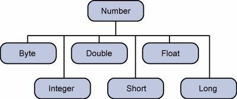
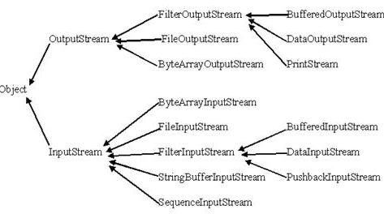

# Java

## 基础语法

javac MyFirstJavaProgram.java ：生成MyFirstJavaProgram.class

java MyFirstJavaProgram : 输出Hello World

```java
public class MyFirstJavaProgram {
    /* 第一个Java程序.  
     * 它将打印字符串 Hello World
     */
    public static void main(String[] args) {
        System.out.println("Hello World"); // 打印 Hello World
    }
}
```

- 类名的首字母应该大写。
- 所有的方法名都应该以小写字母开头。
- 源文件名必须和类名相同，如果文件名和类名不相同则会导致编译错误。
- 所有的Java 程序由**public static void main(String args[])**方法开始执行，**main**是主方法入口。
- 枚举可以单独声明或者声明在类里面。方法、变量、构造函数也可以在枚举中定义。

关键字

- extends：继承
- abstract：抽象类
- final：一个值在初始化后就不能再改变了；方法不能被重写，或者一个类不能有子类
- finally：无论有没有异常都执行的代码
- implements：表示一个类实现了接口
- import：导入类
- instanceof：测试一个对象是否是某个类的实例
- interface：接口，仅有方法和常量的定义
- native：方法用非java代码实现
- super：表示基类
- synchronized：表示同一时间只能由一个线程访问的代码块
- throw：抛出异常
- throws：定义方法可能抛出的异常
- transient：修饰不要序列化的字段
- volatile：标记字段可能被多个线程同时访问，而不做同步

## 对象和类

- 局部变量：局部变量没有默认值，所以局部变量被声明后，必须经过初始化，才可以使用。
- 成员变量：
  - 当一个对象被实例化之后，每个实例变量的值就跟着确定；
  - 实例变量在对象创建的时候创建，在对象被销毁的时候销毁；
  - 实例变量可以声明在使用前或者使用后；
  - 访问修饰符可以修饰实例变量；
  - 实例变量具有默认值；
  - 实例变量可以直接通过变量名访问。但在静态方法以及其他类中，就应该使用完全限定名：ObejectReference.VariableName。
- 类变量（静态变量）：
  - static修饰；
  - 无论一个类创建了多少个对象，类只拥有类变量的一份拷贝；
  - 静态变量储存在静态存储区。经常被声明为常量，很少单独使用static声明变量。
  - 静态变量在程序开始时创建，在程序结束时销毁。
  - 大多数静态变量声明为public类型。
  - 默认值和实例变量相似。变量的值可以在声明的时候指定，也可以在构造方法中指定。此外，静态变量还可以在静态语句块中初始化。
  - 静态变量可以通过：*ClassName.VariableName*的方式访问。
  - 类变量被声明为public static final类型时，类变量名称必须使用大写字母。

如果没有显式地为类定义构造方法，Java编译器将会为该类提供一个默认构造方法。

在创建一个对象的时候，至少要调用一个构造方法。构造方法的名称必须与类同名，一个类可以有多个构造方法。

使用关键字new来创建一个新的对象。创建对象需要以下三步：

- 声明：声明一个对象，包括对象名称和对象类型。
- 实例化：使用关键字new来创建一个对象。
- 初始化：使用new创建对象时，会调用构造方法初始化对象。

源文件声明规则：

- 一个源文件中只能有一个public类
- 一个源文件可以有多个非public类
- **源文件的名称应该和public类的类名保持一致**。例如：源文件中public类的类名是Employee，那么源文件应该命名为Employee.java。
- 如果一个类定义在某个包中，那么package语句应该在源文件的首行。
- 如果源文件包含import语句，那么应该放在package语句和类定义之间。如果没有package语句，那么import语句应该在源文件中最前面。
- import语句和package语句对源文件中定义的所有类都有效。在同一源文件中，不能给不同的类不同的包声明。

import语句

用来提供一个合理的路径，使得编译器可以找到某个类。例如，下面的命令行将会命令编译器载入java_installation/java/io路径下的所有类：

```java
import java.io.*
```

## 基础数据类型

### 内置数据类型：

| -类型     | -说明          | 默认值   | 最小值                        | 最大值                       | 示例   |
| ------- | ------------ | ----- | -------------------------- | ------------------------- | ---- |
| byte    | 8位有符号        | 0     | -128                       | 127                       |      |
| short   | 16位有符号       | 0     | -32768                     | 32767                     |      |
| int     | 32位有符号       | 0     | -2,147,483,648             | 2,147,485,647             |      |
| long    | 64位有符号       | 0L    | -9,223,372,036,854,775,808 | 9,223,372,036,854,775,807 |      |
| float   | 单精度32位       | 0.0f  |                            |                           |      |
| double  | 双精度64位       | 0.0f  |                            |                           |      |
| boolean | true/false   | false |                            |                           |      |
| char    | 16位Unicode字符 |       | '\u0000'(即0)               | '\uffff'(即65535)          |      |

对于数值类型的基本类型的取值范围，我们无需强制去记忆，因为它们的值都已经以常量的形式定义在对应的包装类中了。

Byte.SIZE：二进制位数

Byte.MIN_VALUE：最小值

Byte.MAX_VALUE：最大值

Byte，Short，Integer，Long，Float，Double，Character

### 引用类型

- 引用类型变量由类的构造函数创建，可以使用它们访问所引用的对象。变量一旦声明后，类型就不能被改变了。
- 对象、数组都是引用数据类型。
- 所有引用类型的默认值都是null。
- 一个引用变量可以用来引用与任何与之兼容的类型。

### 常量

```java
final double PI = 3.14;
```

## 修饰符

- 默认的，也称为default，在**同一包内可见**，不使用任何修饰符。
- 私有的，以private修饰符指定，在同一类内可见。被声明为private的方法、变量和构造方法只能被所属类访问，并且类和接口不能声明为private。用来隐藏类的实现细节和保护类的数据。
- 共有的，以public修饰符指定，对所有类可见。
- 受保护的，以protected修饰符指定，对**同一包内的类和所有子类可见**。子类能访问Protected修饰符声明的方法和变量。

访问控制和继承

- 父类中声明为public的方法在子类中也必须为public。
- 父类中声明为protected的方法在子类中要么声明为protected，要么声明为public。不能声明为private。
- 父类中默认修饰符声明的方法，能够在子类中声明为private。
- 父类中声明为private的方法，不能够被继承。

非访问修饰符

- static修饰符，用来创建类方法和类变量。
  - Static关键字用来声明独立于对象的静态变量，无论一个类实例化多少对象，它的静态变量只有一份拷贝。 静态变量也被成为类变量。局部变量能被声明为static变量。
  - Static关键字用来声明独立于对象的静态方法。静态方法不能使用类的非静态变量。静态方法从参数列表得到数据，然后计算这些数据。
  - 对类变量和方法的访问可以直接使用classname.variablename和classname.methodname的方式访问。
- final修饰符，用来修饰类、方法和变量，final修饰的类不能够被继承，修饰的方法不能被继承类重新定义，修饰的变量为常量，是不可修改的。
  - final变量能被显式地初始化并且只能初始化一次。被声明为final的对象的引用不能指向不同的对象。但是final对象里的数据可以被改变。也就是说final对象的引用不能改变，但是里面的值可以改变。
  - final修饰符通常和static修饰符一起使用来创建类常量。
  - 类中的final方法可以被子类继承，但是不能被子类修改，声明final方法的主要目的是防止该方法的内容被修改。
  - final类不能被继承，没有类能够继承final类的任何特性。
- Abstract修饰符，用来创建抽象类和抽象方法。
  - 抽象类不能用来实例化对象，声明抽象类的唯一目的是为了将来对该类进行扩充。
  - 一个类不能同时被abstract和final修饰。如果一个类包含抽象方法，那么该类一定要声明为抽象类。
  - 抽象类可以包含抽象方法和非抽象方法。
  - 抽象方法是一种没有任何实现的方法，该方法的的具体实现由子类提供。抽象方法不能被声明成final和strict。
  - 任何继承抽象类的子类必须实现父类的所有抽象方法，除非该子类也是抽象类。
- Synchronized和volatile修饰符，主要用于线程的编程。
  - Volatile修饰的成员变量在每次被线程访问时，都强迫从共享内存中重读该成员变量的值。而且，当成员变量发生变化时，强迫线程将变化值回写到共享内存。这样在任何时刻，两个不同的线程总是看到某个成员变量的同一个值，保证数据精确，而非缓存数据。
- transient：序列化的对象包含被transient修饰的实例变量时，java虚拟机(JVM)跳过该特定的变量。

```java
public class MyRunnable implements Runnable
{
    private volatile boolean active;
    public void run()
    {
        active = true;
        while (active) // line 1
        {
            // 代码
        }
    }
    public void stop()
    {
        active = false; // line 2
    }
}
```

一般地，在一个线程中调用run()方法，在另一个线程中调用stop()方法。如果line 1中的active位于缓冲区的值被使用，那么当把line 2中的active设置成false时，循环也不会停止。

## 运算符

1. 算术： +、-、*、/、%、++、--
2. 关系：==、!=、>、>=、<、<=
3. 位运算符：&、|、~、^、<<、>>、>>>（无符号右移）
4. 逻辑运算符：&&、||、!
5. 赋值：=、+=、-=、*=、/=、%=、<<=、>>=、&=、|=、^=（异或）
6. instanceOf运算符：`(Object ref variable) instanceOf (class/interface type)`, 返回true/false

## 循环结构

1. while
2. do ... while
3. for(;;)
4. for(声明语句：表达式): 声明语句：声明新的局部变量，该变量的类型必须和数组元素的类型匹配。其作用域限定在循环语句块，其值与此时数组元素的值相等。
5. 表达式：表达式是要访问的数组名，或者是返回值为数组的方法。
6. break
7. continue

## 分支结构

1. if
2. if else
3. if ... else if ... else
4. switch(byte char int short): default不需要break

## Number类

装箱拆箱，所有的包装类（Integer、Long、Byte、Double、Float、Short）都是抽象类Number的子类，Number类属于java.lang包。



```java
public class Test{
   public static void main(String args[]){
      Integer x = 5; // boxes int to an Integer object
      x =  x + 10;   // unboxes the Integer to a int
      System.out.println(x);
   }
}
```

方法：

1. byteValue, intValue, doubleValue, floatValue, longValue, shortValue
2. Integer valueOf(int i)/Integer valueOf(String s)/Integer valueOf(String s, int radix), 每个类型都有valueOf方法，返回的是对应类型
3. toString()
4. parseInt(String s, [int radix])/parseLong(String s, [int radix])/...
5. min()/max()
6. round():最接近的int/long型值
7. random()

## Character类

```java
Character ch = new Character('a');
Character ch2 = 'a';	// 装箱
```

在某些情况下，Java编译器会自动创建一个Character对象。例如，将一个char类型的参数传递给需要一个Character类型参数的方法时，那么编译器会自动地将char类型参数转换为Character对象。 这种特征称为装箱，反过来称为拆箱。

Method：

1. isLetter()/isDigit()/isWhitespace()
2. isUpperCase()/isLowerCase()
3. toUpperCase()/toLowerCase()
4. toString()

## String类

String并非基本类型，而是对象，默认值是null，String有11种构造方法。String类是不可改变的，所以你一旦创建了String对象，那它的值就无法改变了。 如果需要对字符串做很多修改，那么应该选择使用StringBuffer & StringBuilder 类。

Method：

1. length()

2. String concat(String s)

3. +

4. s.format("", args)：格式化字符串

5. char charAt(int index)

6. int compareTo(Object o)/int compareTo(String s)/int compareToIgnoreCase(String s)

7. boolean contentEquals(StringBuffer sb)

8. static String copyValueOf(char[] data)/static String copyValueOf(char[] data, int offset, int count)

9. boolean endsWith(String s)/boolean startsWith(String s)/boolean startsWith(String s, int toffset)

10. boolean equals(Object o)/boolean equalsIgnoreCase(String s)

11. bytes[] getBytes()/bytes[] getBytes(String s)

12. void getChars(int srcBegin, int srcEnd, char[] dst, int dstBegin)

13. int hashCode()

14. int indexOf(int ch)/int indexOf(int ch, int fromIndex)/int indexOf(String s)/int indexOf(String s, int fromIndex)

15. String intern():返回字符串对象的规范化表示形式。

   > 从**常量池**中读取对应字符串的引用，原来没有，则在常量池新增一个。`new String("kill")`kill并没有放入常量池，因为运行时才能确定；String s="kill"，kill这时才放入了常量池，常量池存在于.class中，在运行时被JVM装载，并且可以通过intern()方法扩充。

16. int lastIndexOf(int ch)/int lastIndexOf(int ch, int fromIndex)/int indexOf(String s)/int indexOf(String s, int fromIndex)

17. boolean matches(String regex): 是否匹配正则表达式

18. String replace(char oldChar, char newChar)

19. String replaceAll(String regex, String replacement)/String replaceFirst(String regex, String replacement)

20. String[] split(String regex)/String[] split(String regex, int limit)

21. CharSequence subSequence(int beginIndex, int endIndex)

22. String substring(int beginIndex)/String substring(int beginIndex, int endIndex)

23. char[] toCharArray()

24. String toLowerCase()/String toLowerCase(Locale loc)/String toUpperCase()/String toUpperCase(Locale loc)

25. String toString(): 返回本身

26. String trim(): 返回字符串副本，忽略首位空白

27. static String valueOf(type x)

## StringBuffer和StringBuilder类

StringBuffer和StringBuilder类的对象能够被多次的修改，并且不产生新的未使用对象。StringBuilder类和StringBuffer之间的最大不同在于StringBuilder的方法不是线程安全的（不能同步访问）。StringBuilder相较于StringBuffer有速度优势，所以多数情况下建议使用StringBuilder类。然而在应用程序要求线程安全的情况下，则必须使用StringBuffer类。

StringBuffer&StringBuilder Method:

1. StringBuffer append(String s)
2. StringBuffer reverse()
3. delete(int start, int end)
4. insert(int offset, int i)
5. replace(int start, int end, String str)
6. String toString(): 转为String

String/StringBuffer/StringBuilder比较

1. String是不可变的对象, 因此在每次对String 类型进行改变的时候，都会生成一个新的 String 对象，然后将指针指向新的 String 对象，所以经常改变内容的字符串最好不要用 String ，因为每次生成对象都会对系统性能产生影响，特别当内存中无引用对象多了以后， JVM 的 GC 就会开始工作，性能就会降低。
2. 使用 StringBuffer 类时，每次都会对 StringBuffer 对象本身进行操作，而不是生成新的对象并改变对象引用。所以多数情况下推荐使用 StringBuffer ，特别是字符串对象经常改变的情况下。
3. 如果要操作少量的数据，用String ；单线程操作大量数据，用StringBuilder ；多线程操作大量数据，用StringBuffer。
4. 不要使用String类的"+"来进行频繁的拼接，因为那样的性能极差的，应该使用StringBuffer或StringBuilder类，这在Java的优化上是一条比较重要的原则。

## 数组

### 数组[]

声明

```java
dataType[] arrayRefVar;// prefer
dataType arrayRefVar[];	
```

创建

```java
arrayRefVar = new dataType[arraySize];
```

上面操作包含两步：

1. 使用dataType[arraySize]创建了一个数组。
2. 把新创建的数组的引用赋值给变量 arrayRefVar。

两行可以合并

```java
dataType[] arrayRefVar = new dataType[arraySize];
dataType[] arrayRefVar2 = {v1, v2, v3, ...};
```

例如

```java
double[] myList = new double[10];
```


遍历

```java
for (int i = 0; i < myList.length; i++)
```

数组可以作为参数传递，也可以作为返回值

### Arrays类

提供的所有方法都是静态的

1. static int binarySearch(Object[] a, Object key): 二分查找，必须先排好序
2. static boolean equals(long[] a, long[] a2): 比较两个数组是否完全相同，适用于其他基本类型
3. static void fille(int[] a, int val): val填充a里面的每个元素，适用于其他基本类型
4. static void sort(Object[] a): 对指定对象数组根据其元素的自然顺序进行升序排列。

## 日期时间

## 正则表达式

java.util.regex包主要包括以下三个类：

* **Pattern类: **pattern对象是一个正则表达式的编译表示。Pattern类没有公共构造方法。要创建一个Pattern对象，你必须首先调用其公共静态编译方法，它返回一个Pattern对象。该方法接受一个正则表达式作为它的第一个参数。
* **Matcher类：**Matcher对象是对输入字符串进行解释和匹配操作的引擎。与Pattern类一样，Matcher也没有公共构造方法。你需要调用Pattern对象的matcher方法来获得一个Matcher对象。
* **PatternSyntaxException：**PatternSyntaxException是一个非强制异常类，它表示一个正则表达式模式中的语法错误。

捕获组: 捕获组是把多个字符当一个单独单元进行处理的方法，它通过对括号内的字符分组来创建。捕获组是通过从左至右计算其开括号来编号。例如，在表达式（（A）（B（C））），有四个这样的组：

- ((A)(B(C)))
- (A)
- (B(C))
- (C)

可以通过调用matcher对象的groupCount方法来查看表达式有多少个分组。groupCount方法返回一个int值，表示matcher对象当前有多个捕获组。

```java
import java.util.regex.Matcher;
import java.util.regex.Pattern;
 
public class RegexMatches
{
    private static final String REGEX = "\\bcat\\b";	// \b表示单词边界
    private static final String INPUT =
                                    "cat cat cat cattie cat";
 
    public static void main( String args[] ){
       Pattern p = Pattern.compile(REGEX);
       Matcher m = p.matcher(INPUT); // 获取 matcher 对象
       int count = 0;
 
       while(m.find()) {	// 尝试查找与该模式匹配的输入序列的下一个子序列。
         count++;
         System.out.println("Match number "+count);
         System.out.println("start(): "+m.start());
         System.out.println("end(): "+m.end());
      }
   }
}
```

运行结果

```
Match number 1
start(): 0		// Start方法返回在以前的匹配操作期间，由给定组所捕获的子序列的初始索引
end(): 3		// end方法最后一个匹配字符的索引加1
Match number 2
start(): 4
end(): 7
Match number 3
start(): 8
end(): 11
Match number 4
start(): 19
end(): 22
```

matches 和lookingAt 方法都用来尝试匹配一个输入序列模式。它们的不同是matcher要求整个序列都匹配，而lookingAt 不要求。

```java
private static final String REGEX = "foo";
    private static final String INPUT = "fooooooooooooooooo";
    private static Pattern pattern;
    private static Matcher matcher;
 
    public static void main( String args[] ){
       pattern = Pattern.compile(REGEX);
       matcher = pattern.matcher(INPUT);
  
       System.out.println("lookingAt(): "+matcher.lookingAt());	// true
       System.out.println("matches(): "+matcher.matches());	// false
   }
```

Method:

1. replaceFirst：用来替换匹配正则表达式的文本，replaceFirst 替换首次匹配。
2. replaceAll ：用来替换匹配正则表达式的文本，replaceAll 替换所有匹配。
3. Matcher appendReplacement(StringBuffer sb, String replacement)：实现非终端添加和替换步骤。
4. public StringBuffer appendTail(StringBuffer sb)：实现终端添加和替换步骤。

## 方法

### 可变参数：

1. 在方法声明中，在指定参数类型后加一个省略号(...) 。
2. 一个方法中只能指定一个可变参数，它必须是方法的最后一个参数。任何普通的参数必须在它之前声明。

```java
typeName... parameterName
```

```java
public class VarargsDemo {
 
   public static void main(String args[]) {
      // 调用可变参数的方法
      printMax(34, 3, 3, 2, 56.5);
      printMax(new double[]{1, 2, 3});
   }
 
   public static void printMax( double... numbers) {
   if (numbers.length == 0) {	// 长度为参数个数
      System.out.println("No argument passed");
      return;
   }
 
   double result = numbers[0];	// 类似于数组，通过下标访问
 
   for (int i = 1; i <  numbers.length; i++)
      if (numbers[i] >  result)
      result = numbers[i];
      System.out.println("The max value is " + result);
   }
}
```

### finalize() 方法

在对象被垃圾收集器析构(回收)之前调用，这个方法叫做finalize( )，它用来清除回收对象。功能和C++的析构方法相似，但是调用时机不同。

> 垃圾回收周期性地运行，检查对象不再被运行状态引用或间接地通过其他对象引用。就在对象被释放之前，Java 运行系统调用该对象的finalize( ) 方法。理解finalize( ) 正好在垃圾回收以前被调用非常重要。当一个对象超出了它的作用域时，finalize( ) 并不被调用。这意味着你不可能知道何时——甚至是否——finalize( ) 被调用。因此，你的程序应该提供其他的方法来释放由对象使用的系统资源，而不能依靠finalize( ) 来完成程序的正常操作。
>
> 这与C++的析构函数有所不同。

```java
System.gc(); //调用Java垃圾收集器
```

## 流(stream)文件(file)和IO

**一个流可以理解为一个数据的序列。输入流表示从一个源读取数据，输出流表示向一个目标写数据。**

### 控制台输入

```java
BufferedReader br = new BufferedReader(new InputStreamReader(System.in));
```

BufferedReader对象创建后，我们便可以使用read()方法从控制台读取一个字符，或者用readLine()方法读取一个字符串。

```java
// read
char c;
BufferedReader br = new BufferedReader(new InputStreamReader(System.in));
System.out.println("Enter characters, 'q' to quit.");
do {
    c = (char) br.read();
    System.out.println(c);
} while(c != 'q');
```

结果如下，输入一行，按回车，对输入法的一行字符串依次读取每个字符。

```
Enter characters, 'q' to quit.
123aqcq
1
2
3
a
q
```

readLine()

```java
BufferedReader br = new BufferedReader(new InputStreamReader(System.in));
String str;
System.out.println("Enter lines of text.");
System.out.println("Enter 'end' to quit.");
do {
   str = br.readLine();
   System.out.println(str);
} while(!str.equals("end"));
```

输出如下，即是通过整行字符串判断，无法自动结束

```
Enter lines of text.
Enter 'end' to quit.
This is line one
This is line one
This is line two
This is line two
end
end
```

### 控制台输出

System.out.print()

System.out.write()



### FileInputStream类

该流用于从文件读取数据。

```java
InputStream f = new FileInputStream("C:/java/hello");
// 或者
File f = new File("C:/java/hello");
InputStream f = new FileInputStream(f);
```

Method: 以下方法皆throws IOException{}

1. close()
2. finalize()
3. int read(int r): 从InputStream对象读取指定字节的数据。返回为整数值。返回下一字节数据，如果已经到结尾则返回-1。
4. int read(byte[] r): 从输入流读取r.length长度的字节。返回读取的字节数。如果是文件结尾则返回-1。
5. int available(): 返回下一次对此输入流调用的方法可以不受阻塞地从此输入流读取的字节数。

### FileOutputStream

该类用来创建一个文件并向文件中写数据。如果该流在打开文件进行输出前，目标文件不存在，那么该流会创建该文件。

```java
OutputStream f = new FileOutputStream("C:/java/hello")
// 或者
File f = new File("C:/java/hello")
OutputStream f = new FileOutputStream(f);
```

Method:

1. close()
2. finalize()
3. write(int w)
4. write(byte[] w)

```java
import java.io.*;
 
public class fileStreamTest{
 
   public static void main(String args[]){
    
   try{
      byte bWrite [] = {11,21,3,40,5};
      OutputStream os = new FileOutputStream("test.txt");
      for(int x=0; x < bWrite.length ; x++){
         os.write( bWrite[x] ); // writes the bytes
      }
      os.close();
      
      InputStream is = new FileInputStream("test.txt");
      int size = is.available();
 
      for(int i=0; i< size; i++){
         System.out.print((char)is.read() + "  ");
      }
      is.close();
   }catch(IOException e){
      System.out.print("Exception");
   }   
   }
}
```

### 

### 

### ByteArrayInputStream类

字节数组输入流在内存中创建一个字节数组缓冲区，从输入流读取的数据保存在该字节数组缓冲区中。

```java
ByteArrayInputStream bArray = new ByteArrayInputStream(byte [] a);
ByteArrayInputStream bArray = new ByteArrayInputStream(byte []a,
                                                       int off,
                                                       int len)
```

### ByteArrayOutputStream类

字节数组输出流在内存中创建一个字节数组缓冲区，所有发送到输出流的数据保存在该字节数组缓冲区中。

```java
OutputStream bOut = new ByteArrayOutputStream();
OutputStream bOut = new ByteArrayOutputStream(int a);
```

```java
import java.io.*; 
public class ByteStreamTest { 
   public static void main(String args[])throws IOException { 
      ByteArrayOutputStream bOutput = new ByteArrayOutputStream(12); 
      while( bOutput.size()!= 10 ) {
         // 获取用户输入值
         bOutput.write(System.in.read());
      } 
      byte b [] = bOutput.toByteArray();
      System.out.println("Print the content");
      for(int x= 0 ; x < b.length; x++) {
         // 打印字符
         System.out.print((char)b[x]  + "   ");
      }
      System.out.println("   "); 
      int c; 
      ByteArrayInputStream bInput = new ByteArrayInputStream(b); 
      System.out.println("Converting characters to Upper case " );
      for(int y = 0 ; y < 1; y++ ) {
         while(( c= bInput.read())!= -1) {
            System.out.println(Character.toUpperCase((char)c));
         }
         bInput.reset();
      }
   }
}
```

### DataInputStream类

数据输入流允许应用程序以与机器无关方式从底层输入流中读取基本 Java 数据类型。

```java
DataInputStream dis = DataInputStream(InputStream in);
```

Method: 以下皆为final方法且throws IOException

1. int read(byte[] r, int off, int len)
2. int read(byte[] b)
3. Boolean readBoolean()/byte readByte()/short readShort()/Int readInt()
4. String readLine()

> DataInputStream的readline()不经常使用，通常用如下方法取代
>
> ```java
> BufferedReader d  = new BufferedReader(new InputStreamReader(in));
> ```

### DataOutputStream类

数据输出流允许应用程序以与机器无关方式将Java基本数据类型写到底层输出流。

```java
DataOutputStream out = DataOutputStream(OutputStream  out);
```

Method: 以下皆为final方法且throws IOException

1. write(byte[] w, int off, int len)
2. int write(byte[] b)
3. writeBoolean()/writeByte()/writeShort()/writeInt(): 这些方法将指定的基本数据类型以字节的方式写入到输出流。
4. flush(): 刷新此输出流并强制写出所有缓冲的输出字节。
5. writeBytes(String s): 将字符串以字节序列写入到底层的输出流，字符串中每个字符都按顺序写入，并丢弃其高八位。

```java
import java.io.*; 
public class Test{
   public static void main(String args[])throws IOException{ 
      DataInputStream d = new DataInputStream(new
                               FileInputStream("test.txt")); 
      DataOutputStream out = new DataOutputStream(new
                               FileOutputStream("test1.txt")); 
      String count;
      while((count = d.readLine()) != null){
          String u = count.toUpperCase();
          System.out.println(u);
          out.writeBytes(u + "  ,");
      }
      d.close();
      out.close();
   }
}
```

### File类

一个目录其实就是一个File对象，它包含其他文件和文件夹。如果创建一个File对象并且它是一个目录，那么调用`isDirectory( )`方法会返回true。可以通过调用该对象上的`list()`方法，来提取它包含的文件和文件夹的列表。

方法比较全，使用时先查下文档。

1. mkdir()
2. mkdirs()

```java
String dirname = "/tmp/user/java/bin";
File d = new File(dirname);
// 现在创建目录
d.mkdirs();
```

### FileReader类

继承InputStreamReader

1. FileReader(File file)
2. FileReader(FileDescriptor fd)
3. FileReader(String fileName)
4. public int read() throws IOException
5. public int read(char [] c, int offset, int len)

### FileWriter类

继承OutputStreamReader

1. FileWriter(File file)
2. FileWriter(File file, boolean append)
3. FileWriter(FileDescriptor fd)
4. FileWriter(String filename, boolean append)
5. public void write(int c) throws IOException: 写入单个字符c。
6. public void write(char [] c, int offset, int len): 写入字符数组中开始为offset长度为len的某一部分。
7. public void write(String s, int offset, int len): 写入字符串中开始为offset长度为len的某一部分。

```java
import java.io.*;
public class FileRead{
   public static void main(String args[])throws IOException{
      File file = new File("Hello1.txt");
      // 创建文件
      file.createNewFile();
      // creates a FileWriter Object
      FileWriter writer = new FileWriter(file);
      // 向文件写入内容
      writer.write("This\n is\n an\n example\n");
      writer.flush();
      writer.close();
      //创建 FileReader 对象
      FileReader fr = new FileReader(file);
      char [] a = new char[50];
      fr.read(a); // 从数组中读取内容
      for(char c : a)
          System.out.print(c); // 一个个打印字符
      fr.close();
   }
}
```

## 异常处理

### Exception类的层次


Error用来指示运行时环境发生的错误。Java程序通常不捕获错误。错误一般发生在严重故障时，它们在Java程序处理的范畴之外。

### Java 内置异常类

Java 语言定义了一些异常类在java.lang标准包中。java.lang包是默认加载到所有的Java程序的，所以大部分从运行时异常类继承而来的异常都可以直接使用。

1. ArithmeticException
2. ArrayIndexOutOfBoundsException
3. ClassCastException
4. IllegalArgumentException
5. NullPointerException
6. ClassNotFoundException
7. CloneNotSupportedException: 当调用 Object 类中的 clone 方法克隆对象，但该对象的类无法实现 Cloneable 接口时，抛出该异常。
8. IllegalAccessException
9. InstantiationException: 当试图使用 Class 类中的 newInstance 方法创建一个类的实例，而指定的类对象因为是一个接口或是一个抽象类而无法实例化时，抛出该异常。
10. InterruptedException: 一个线程被另一个线程中断，抛出该异常。
11. NoSuchFieldException
12. NoSuchMethodException

### 异常方法

1. String getMessage(): 返回关于发生的异常的详细信息。
2. Throwable getCause(): 返回一个Throwable 对象代表异常原因。
3. String toString()
4. void printStackTrace(): 打印toString()结果和栈层次到System.err，即错误输出流。
5. StackTraceElement[] getStackTrace()
6. Throwable fillInStackTrace()

### 捕获异常

try...catch

```java
import java.io.*;
public class ExcepTest{ 
   public static void main(String args[]){
      try{
         int a[] = new int[2];
         System.out.println("Access element three :" + a[3]);
      }catch(ArrayIndexOutOfBoundsException e){
         System.out.println("Exception thrown  :" + e);
      }
      System.out.println("Out of the block");
   }
}
```

### 多重捕获块

一个try代码块后面跟随多个catch代码块的情况就叫多重捕获。

```java
try{
	...
}catch(Exception e1) {
	...
}catch(Exception e2) {
	...
}finally {
	...
}
```

### throws/throw关键字

如果一个方法没有捕获一个检查性异常，那么该方法必须使用throws 关键字来声明。throws关键字放在方法签名的尾部。

一个方法可以声明抛出多个异常，多个异常之间用逗号隔开。

```java
public void withdraw(double amount) throws RemoteException, InsufficientFundsException
{}
```

### finally关键字

finally关键字用来创建在try代码块后面执行的代码块。无论是否发生异常，finally代码块中的代码总会被执行。在finally代码块中，可以运行清理类型等收尾善后性质的语句。

### 声明自定义异常

* 所有异常都必须是Throwable的子类。
* 如果希望写一个检查性异常类，则需要继承Exception类。
* 如果你想写一个运行时异常类，那么需要继承RuntimeException 类。

